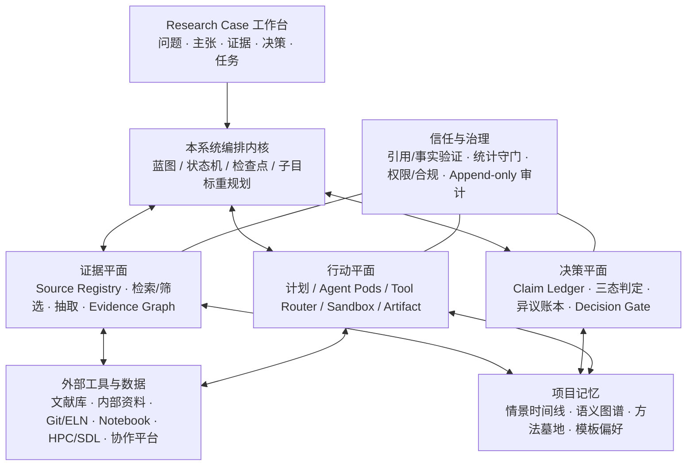

# 从证据到决策：一个 AI 研究伙伴

> **文档定位说明（2026-07-21）**：本文是领域、市场与长期产品愿景的背景研究，文中的 Evidence-to-Action OS 和分期不等同于当前 Demo 范围。Research Radar 的首篇论文、MVP 与技术实现以 [`research_radar_MVP研究与技术路线_v0.5.md`](./research_radar_MVP研究与技术路线_v0.5.md) 为准；[`v0.4`](./research_radar_MVP研究与技术路线_v0.4.md) 保留为第一次收敛基线。

> **面向研究团队的 Evidence-to-Action OS（证据到行动操作系统）构建蓝图。**
>
> AI 科研工具已经把“找、读、写”的效率推到很高：Elicit 把系统综述做成可审计的检索—筛选—抽取流程，Consensus 以结构化证据表服务研究问题，ResearchRabbit 用引文网络帮助发现相邻工作，Bohrium 把检索、深研、配图和知识沉淀收进一个任务化入口。它们并没有走错；真正尚未被完整解决的是：**证据如何在一个研究项目中持续积累，并被转化为可质疑的判断、可执行的计划和可复现的成果。**
>
> 答案是：一个诚实地标示“已知、前沿与未知”的系统；一个把来源、主张、反证、决策、实验和结果串成可审计研究资产的系统；一个让人类负责方向、品味与问责，让 Agent 负责证据加工、执行与持续监测的研究伙伴。

---

# 1. 现有工具已解决局部效率，项目级闭环仍然缺失

## 1.1 结构性失衡：科研的根本矛盾

多项调查都指向同一个结构性矛盾：**个体认知带宽基本恒定，而集体知识以远高于阅读能力的速度累积。** 中国一项针对1,324名科研人员的调查显示，实验设计与实施占28.2%，收集整理资料占27.3%，论文/专利/模型形成与修改占16.9%[^1]；另有常被国内文献信息素养课件引用的 NSF 时间分配估算认为，科研人员约51%时间用于查找和消化资料，仅8%用于计划思考（原始 NSF 报告编号待进一步核实）[^1]。与此同时，科学产出在过去数十年持续高速增长，而人类阅读速度基本未变；没有技术能让研究者简单地“读完一切”。

现有产品已有效压缩了局部工作：Elicit 将系统综述的检索、筛选、抽取和报告过程显性化并保留人工复核；Consensus 将研究问题拆成可筛选、可比对的研究证据；ResearchRabbit 把引文关系和收藏协作变成探索界面；Bohrium 将一个研究问题分派到检索、深研、写作、绘图和知识库任务。这些能力是本系统必须吸收的基线，而不是要推翻的对象。

真正断裂发生在它们之间及其之后：一篇论文为什么被纳入、某个结论为什么被采信、有哪些反证没有被解决、团队在哪个节点作出了什么决定、代码和实验是否真实运行过，通常仍散落在聊天记录、表格、PDF 批注、会议纪要和个人记忆中。因此，下一代产品不应只追求“更快处理信息”，而应让团队在有限认知带宽下**形成、审视、执行和复用更好的研究判断**。

## 1.2 从优秀单点能力到项目级闭环：市场仍缺什么

| 产品/能力范式 | 已验证的优秀能力 | 仍然缺失的项目级对象 | 本系统的吸收方式 |
|------|----------------|----------------------|----------------|
| Elicit | 可编辑的检索—筛选—抽取—综合链路；逐步可审计 | 综述之后的研究决策、实验和长期项目记忆 | 将 evidence matrix 升级为可持续更新的“证据账本” |
| Consensus | 研究问题导向检索、研究设计/人群/结果等结构化快照与表格 | 证据冲突如何影响具体假设和下一步 | 将每个快照连到主张、反证和决策门 |
| ResearchRabbit / Connected Papers | 引文网络、相邻工作发现、收藏与协作 | 图谱没有进入研究设计和团队决策 | 以“证据—主张—方法—结果”图谱替代单纯论文图谱 |
| Bohrium | 一题起步的任务入口；检索、深研、写作、绘图、知识库和计算生态 | 对项目判断、异议和失败经验的持续管理 | 用本系统编排层调度外部工具，把结果回写为研究资产 |
| 通用 Deep Research / 编程 Agent | 多步规划、报告生成、代码和数据处理 | 开放环境下的引用、执行结果和方法论不可默认信任 | 强制来源接地、沙箱回执、统计守门和人工审批 |

这些产品共同证明了两个事实：一是用户愿意把文献加工和部分执行交给 Agent；二是高风险研究任务必须把过程暴露给用户。本系统的机会不是做“又一个更全的工具箱”，而是成为工具箱之上的**项目级证据与决策层**：让每次搜索、筛选、讨论、分析和实验都沉淀为下一次可用的研究资产。

## 1.3 我们的定位：不是另一个研究工具，而是研究的证据—决策层

|            | 单点科研工具 | **本系统：研究伙伴 / 证据—决策层** |
| ---------- | ------------------------ | -------------------------- |
| **核心问题** | “怎么把一个任务完成得更快？” | “基于什么证据，团队该相信什么、下一步做什么？” |
| **核心对象** | 论文、聊天、报告或代码文件 | Research Case：问题、主张、证据、异议、决策、计划、执行和结果 |
| **对不确定性的态度** | 优化答案流畅度与引用数量 | 区分已知 / 前沿 / 未知，并为每一态给出不同动作 |
| **核心交互** | 搜索 → 阅读 → 写作 | 立项 → 证据加工 → 判断 → 行动 → 复盘 → 持续监测 |
| **产品形态** | 可替换的功能集合 | 可集成的项目操作系统；连接现有工具而非替代一切 |
| **北极星指标** | 搜索次数、生成字数、单次任务耗时 | 被确认、复用并推动行动的“可验证研究资产”数量及其复用率 |

这一章确立的不是“现有方向错了”，而是本系统的补位：把已经成熟的科研工具能力，组织成一个可被团队持续审视和复用的研究闭环。后续章节从科研哲学、流程、痛点和竞品出发，最终在第 6 章收敛为可落地的产品概念与架构。

---

## 1.4 科研的认识论前提：研究不是信息处理，而是可证伪的判断循环

科学研究是"通过系统性创新活动探索自然规律、创造新技术的知识生产行为"[^2]。其实质是以系统性质疑为核心的认知实践——面对未知而非已知，生产问题的进化而非答案的堆砌。

常被国内文献信息素养课件引用的 NSF 时间分配估算认为，科研人员约51%时间用于查找和消化资料，8%用于计划思考，32%用于实验研究；该估算的原始 NSF 报告编号较难定位[^1]。中国科研人员的时间分配有相对清晰的本土调查：黄艳红（2011）对中科院、省立研究院和研究型大学1,324名科研人员的调查显示，实验设计与实施占28.2%，收集整理资料占27.3%，论文/专利/模型形成与修改占16.9%[^1]。科研活动的大部分时间消耗在信息筛选、问题界定和方法论反思上。

科研与信息检索、知识学习有根本区别：检索寻找已知答案，学习吸收已有知识，而科研主动制造"认知冲突"——通过可证伪的假设、对照实验和接受负面结果，持续压缩无知边界。科学产出自19世纪以来呈指数级增长（有研究估计全球科学产出约每9年翻倍），而人类阅读速度基本未变[^1]。在这一结构性信息过载中，科研的核心能力已从"记住更多"转变为"质疑得更好"。

**科学与科研的区分**：科学是已知的知识体系——经过验证的理论、定律和事实的集合，存在于教科书和数据库中。科研是探索未知的过程——动态、不确定、以失败和修正为常态。二者如水库与水流：科学是蓄积的水，科研是汇入新水源的流动过程。

这一区分决定了AI Agent的角色定位。若AI被设计为"生产科学知识"，它将倾向于复制已有内容——这正是LLM的强项也是其局限。2025年*Nature Scientific Reports*的实证研究表明，生成式AI只能实现"增量发现"（incremental discovery），无法实现"根本性发现"（fundamental discovery），核心原因在于AI缺乏好奇心和想象力，无法跳出已知假设空间[^3]。因此，AI Agent的合理定位不是"替代科学家生产科学"，而是"增强科学家开展科研"——放大人类系统性质疑的能力，接管重复性信息处理。

科研还具有纠错功能。科学不是真理仓库，而是"纠错引擎"。Nature 2016年对1576名科学家的调查显示，超过70%未能复制他人实验，超过半数无法重复自己的实验[^4]。2024年生物医学领域72%的研究者认同存在可重复性危机[^5]。科研的持续运转依赖对既有结论永不停止的再检验。

## 1.5 科研的哲学根基

**Popper证伪主义**：科学理论永远无法被最终证实，只能被证伪[^6]。无论多少正面证据，都无法排除未来反例；但一个确凿反例即可推翻理论。对AI Agent而言，这意味着推理架构必须内置"自我否定"能力——在证据不足时主动标记不确定性，在发现矛盾时提出质疑。科研的价值在于提出可被错误检验的假设。

**Kuhn范式理论**：科学通过"范式转换"实现革命性跃迁[^7]。常规科学阶段在既有范式内解决谜题；当反常积累到无法被现有范式消化时，科学革命发生。当前AI for Science究竟是常规科学内的新工具，还是新范式的雏形？判断标准是AI是否改变了科学共同体对"有效问题"和"有效答案"的基本共识。

**第五范式：AI for Science**。鄂维南院士2018年提出"AI for Science"概念[^8]，李国杰院士2024年正式命名为"智能化科研"（AI4R）[^9]。五个范式的演进：经验科学→理论科学→计算科学→数据密集型科学→AI for Science。第五范式的核心张力是数据驱动与假设驱动的方法论冲突——数据驱动方法不会取代理论和假设，而是与之互补[^10]。AI Agent架构应在"数据探索模式"与"假设验证模式"之间动态切换。

## 1.6 科研的三重核心特征

科研区别于其他认知实践的三个维度：

| 比较维度 | 科学研究 | 技术开发 | 工程应用 | 知识传播 |
|:---------|:---------|:---------|:---------|:---------|
| 核心目标 | 探索未知，生产可证伪的新知识 | 创造新工具/产品原型 | 约束条件下解决实际问题 | 系统化传递已有知识 |
| 知识状态 | 根本性不确定，答案未知 | 基于已知科学原理的组合创新 | 应用成熟技术规范 | 传授已验证的确定内容 |
| 验证标准 | 可重复性实验、同行评审、统计显著性 | 技术可行性测试、专利审查 | 安全性、经济性、用户满意度 | 学习效果评估 |
| 失败价值 | 否定假设即贡献，失败推动边界 | 指示设计缺陷，需重新迭代 | 成本损失，需规避 | 调整教学方法 |

科研同时在"未知性""可证伪性""共同体裁决"三个维度上保持独特配置。仅模拟论文输出形式而不复现假设检验逻辑、可重复性约束和同行评审机制的Agent，是科研的"仿制品"而非"增强器"。

**科学共同体的集体性**：科研成果在被科学共同体评价和确认前不构成"科学知识"。同行评审系统正面临严重危机：审稿人供给萎缩、审稿周期拉长、质量承压（详见第2.1节与第3.3.2节）[^11]。据公开报道，全球已有近450万科学家使用Bohrium等AI for Science平台[^12]，预印本和开放科学运动正在重塑"共同体确认"的机制本身。

## 1.7 Vibe Science：科研人机协作的新范式

2025-2026年间，从Karpathy的Vibe Coding到OpenAI的Vibe Research再到GRAIL的Vibe Science，形成了清晰的概念谱系（具体时间据公开报道）。南洋理工大学Feng & Liu（2026）给出了严谨定义：**人类研究者提供高层次指导和批判性评估，LLM智能体根据自然语言指令执行研究中的劳动密集型部分**[^13]。

**五项核心原则**[^13]：(1) 人类作为创意总监——选择问题、判断重要性、做战略决策；(2) 自然语言作为主要接口；(3) 委托加监督——任务交给智能体但研究者审查结果；(4) 迭代精炼——研究者阅读输出、提出批评、智能体修订；(5) 人类问责——研究者为每一项声明负责，AI不是共同作者。

**五步交互循环**：Instruct→Execute→Present→Evaluate→Redirect，形成迭代闭环。五阶段工作流：构思（人类主导）→探索（AI执行）→实验（AI执行）→综合（AI执行）→精炼（人类主导）。

**七种AI失败模式**[^14]：

> 注：以下分类是基于当前全自主科研 Agent 公开失败案例与本报告前期研究的综合归纳，并非直接来自单一同行评审论文。

| 编号 | 失败模式 | 产品防御策略 |
|:---:|---------|------------|
| M1 | 实现bug通过自审 | 代码沙箱+自动化测试+人工抽检 |
| M2 | 引用幻觉 | 实时Crossref/DOI验证 |
| M3 | 实验结果幻觉 | 执行日志+诚实失败报告 |
| M4 | 捷径依赖 | 方法论合规性检查清单 |
| M5 | Bug被误认为洞见 | 结果与预期偏差自动标记 |
| M6 | 方法论伪造 | 代码与论文方法对齐验证 |
| M7 | 帧锁定 | 定期触发"假设重审"checkpoint |

**核心悖论**："光鲜的平庸"——AI生成的文本默认流畅专业，解耦了表面质量与底层工作的深度[^13]。"验证不对称性"——最值得委托给AI的任务也最难验证，劳动从生产转移到检验而非消除。

> "风险不在于AI将取代科学家，而在于科学家将不谨慎地使用AI并将结果称为研究。"[^13]

Vibe Science不是让科研变随意，而是通过自动化重复劳动，让研究者将精力投入到真正需要人类判断力的环节。产品设计目标不是"减少人类参与"，而是"提升人类参与的质量"。

---

# 2. 科研流程全景拆解：从问题到发表的完整地图

科研并非一条笔直的高速公路，而是一张由反复试探、修正和迭代编织而成的网络——这正是第1.4节Vibe Science所描述的人机协作迭代循环（Instruct→Execute→Present→Evaluate→Redirect）在流程层面的具象表现。理解这张网络的结构，是AI Agent产品定位的前提：只有知道科研人员在每个节点做什么、卡在哪里、需要什么，才能设计出真正嵌入工作流的产品。本章以标准化流程的八个阶段为骨架，以非线性迭代和跨学科差异为血肉，绘制一幅可供AI产品经理按节点定位的科研全景地图。

## 2.1 标准化科研流程的八个阶段

科研遵循一套可识别的阶段序列。Babbie将研究定义为"一种系统性探究，涉及归纳和演绎方法"[^2]。

**1. 问题识别**：将模糊的不完整模式转化为可操作的研究问题，分为生产实践问题和哲学概念问题两类。

**2. 文献回顾**：贯穿科研始终的动态过程。基于PRISMA框架包含六步骤——确定问题、检索策略、筛选、数据提取、质量评估、证据综合[^4]。系统综述最大挑战是工作量巨大，且新论文在综述撰写期间持续发表。在全球年发表论文超过300万篇、部分学科存在大量低被引或零被引成果的出版通胀背景下[^15]——例如计算机科学约45%论文五年未被引用，而生物医学、物理、化学的五年零引用率则低得多——文献回顾已成为制约科研产出的首要瓶颈。

**3. 假设构建**：有效的假设必须满足两个条件——合理解释观察现象、具有可检验性（能被证实或证伪）[^10]。AI驱动的假设生成（如The AI Scientist、SciAgents）利用了LLM和知识图谱整合实现跨学科发现[^9]。但Stanford大规模研究表明，AI想法比人类更具新颖性，但可行性较弱[^8]——Agent在假设生成环节应定位为"发散器"而非"决策者"。

**4. 研究设计**：核心要素清单：

| 核心要素 | 常见问题 | AI Agent可介入点 |
|---------|---------|----------------|
| 变量定义 | 变量混淆导致因果推断失效 | 自动识别潜在混淆变量 |
| 样本量计算 | 样本不足导致功效不足 | 功效分析与样本量推荐 |
| 随机化方案 | 随机化执行不当 | 方案自动生成与验证 |
| 盲法设计 | 盲法破缺影响客观性 | 合规性检查 |
| 对照组设置 | 设计不当引入系统误差 | 方案建议 |
| 伦理审查 | 审批流程冗长 | 材料自动整理 |

心理学领域发表结果中约92%具有统计显著性，但检测中等效应量的平均统计功效仅约44%（Fanelli 2010；Szucs & Ioannidis 2017，见 Stanford Encyclopedia of Philosophy 综述）[^12]——大量研究因样本量不足产生假阳性或假阴性。

**5. 数据收集**：遵循FAIR原则（Findable, Accessible, Interoperable, Reusable）[^16]。AI Agent可介入：自动化采集预处理、实时质量监控、智能标注清洗、实验记录归档。

**6. 数据分析**：标准流程包括数据清洗、描述性统计、推断性统计、模型构建、结果可视化[^17]。核心挑战是方法选择正确性——心理学大规模复制仅约40%结果可被复制[^18]，深层原因之一是统计方法缺陷未在审稿阶段被有效识别。

**7. 结果解释**：严格区分"支持假设"与"证实假设"——实验只能证伪不可证实。区分统计显著性与实际意义（p<0.05的大样本效应量可能极小）。

**8. 写作与发表**：全球学术出版从投稿到发表平均5-18个月[^19]。Nature 2025年调查显示超过90%研究者接受使用AI进行编辑翻译，约三分之二接受AI帮助撰写初稿，但超过50%不赞成AI撰写同行评审[^20]。同行评审系统面临 reviewer 供给萎缩：政治学期刊研究显示审稿邀请接受率通常仅40%-60%，编辑往往需要邀请多名潜在审稿人才能获得足够评审；2024年对57本健康政策期刊的分析显示首次审稿决定中位数约60.5天，最终审稿决定中位数约198天[^21]。

## 2.2 流程的非线性与迭代特征

真实的科研流程是迭代循环而非单向流水线。科研Agent需要"项目级记忆"——理解完整研究上下文，在假设修正时自动回溯文献，在写作时引用之前的数据分析结果。

薛其坤院士的科研创新三层次模型——"0→1"（原创性发现）、"1→10"（拓展与完善）、"10→100"（工程化应用）——揭示了不同层次研究人员需要不同的Agent能力[^22]："0→1"需要假设生成和跨学科联想，"1→10"需要实验设计和数据分析严谨性，"10→100"需要知识管理和技术转移辅助。

## 2.3 跨学科差异

不同学科在认识论、方法论、数据特征和评估标准上存在系统性差异：

| 对比维度 | 实验科学 | 理论科学 | 计算科学 |
|---------|---------|---------|---------|
| 认识论基础 | 实证主义 | 理性主义 | 混合：实证+形式+工程 |
| 核心方法 | 控制实验、RCT、统计推断 | 形式化证明、逻辑演绎 | 算法分析、系统构建、基准测试 |
| 可重复性标准 | 实验可复现、数据可获取 | 证明可验证、推导可追溯 | 代码可运行、环境可重建 |
| 典型可复制率 | 心理学~40%、肿瘤生物学~25% | 接近100%（逻辑必然） | 依赖环境配置 |
| AI适配难度 | 中 | 高 | 低（AI原生友好） |

定量研究（演绎推理，回答"什么"和"到什么程度"）与定性研究（归纳推理，回答"如何"和"为什么"）的分野同样深刻。混合方法研究占比从2011年的0.64%增长到2024年的2.97%[^23]。跨学科差异直接影响AI Agent功能设计——实验科学需要样本量和随机化检查，计算科学需要代码版本和环境配置检查，理论科学需要证明步骤完备性检查。不同学科的评审文化也截然不同：STEM评审更关注技术严谨性，人文社科评审更关注概念原创性[^24][^25]。

---

理解科研流程的全景地图，是AI Agent产品切入科研场景的基础。八个标准化阶段构成了科研人员工作的基本单元，非线性迭代特征揭示了真实工作流的复杂性，而跨学科差异则划定了产品适配的边界条件。下一章将从这一流程框架出发，深入剖析科研人员在每个阶段的具体痛点——这些痛点正是AI Agent产品机会的坐标。

---

# 3. 科研人员的痛点地图：每个阶段的时间黑洞

对AI产品经理而言，理解科研人员的真实痛点不是"锦上添花"的市场调研，而是决定产品生死的需求验证。本章基于NSF、Elsevier、Nature、中国科协等权威机构的调查数据，绘制一幅科研人员全周期的痛点地图，为后续AI Agent产品的功能设计提供实证锚点。

## 3.1 时间分配的真相

#### 3.1.1 全球数据：被行政事务吞噬的科研时间

常被国内文献信息素养课件引用的 NSF 时间分配估算指出，科研人员约51%工作时间用于查找和消化资料，仅约8%用于计划与深度思考；该组数字的原始 NSF 报告编号较难定位[^2]。Elsevier 2025年对113国3,200余名科研人员的调查进一步印证——全球仅45%的科研人员认为自己拥有足够的科研时间，68%表示发表论文的压力比两三年前更大[^1]。

科研时间的结构性压缩并非均匀分布。2012至2022年间，中国研发人员全时当量占比从71.0%下降至67.6%[^4]，意味着每百名研发人员中用于实际科研的人数十年间减少了近3.5人。时间总量的减少与产出要求的上升形成"剪刀差"，构成科研人员焦虑的制度性根源。

**表1：中美科研人员时间分配与压力对比**

| 维度 | 中国 | 美国 | 数据来源 |
|------|------|------|----------|
| 直接科研时间占比 | 67.6%（2022年）[^4] | PI联邦项目时间中行政占42%[^5] | 中国科协 / FDP调查 |
| 认为时间不足的比例 | 43.9%[^6] | 45%感到精疲力竭[^7] | 中国科协 / Nature调查 |
| 时间不足首要原因 | 行政事务（56.3%）[^6] | 行政负担（42%联邦项目时间）[^5] | 中国科协 / FDP调查 |
| 第二大原因 | 考核频繁（39.7%）[^6] | 发表压力上升（68%）[^1] | 中国科协 / Elsevier调查 |
| 超长工作比例 | 30.86%每周超60小时（2017年中科院青年科研人员调查）[^10] | 70%研究生每周超40小时[^9] | 中国青年报/中科院青促会 / Nature调查 |
| 青年基金资助率 | 约17%（国自然青年基金）[^8] | NSF FY2025约19%[^3] | 中国新闻网 / Grantsights |

上表揭示了一个关键跨国差异：中美科研人员的时间压力表现形式不同，但根源一致——行政负担对科研时间的侵蚀。中国的行政负担更加显性化（报销、填表、考核），而美国PI的行政负担更多体现在项目管理和合规文档上。这一差异对AI Agent产品具有直接启示：面向中国市场的产品应将"行政减负"作为核心卖点，面向国际市场则应聚焦项目管理自动化。从资助竞争看，中国国自然青年基金资助率长期徘徊在17%，2019至2023年间申请量增长33.8%而资助率几无变化[^8]；美国NSF资助率从FY2024的26%降至FY2025的19%[^3]。资金稀缺正将科研人员推向更激烈的竞争，而竞争本身又消耗了大量本可用于科研的时间。

#### 3.1.2 中国特殊压力：制度性时间挤压

中国科研人员面临的制度性压力具有鲜明本土特征。在"非升即走"制度下，青年教师需完成4篇SCI/SSCI 2区论文和1个国家级基金项目的"最低标准"，"2篇在投、3篇在写、5篇在谋划"成为常态[^11]。中国社科院2025年调查显示，高校青年教师实际工作时间通常每天10至12小时、每周约6天，其中至少一天用于行政事务[^10]。湖北省调查进一步显示，42.7%的科技工作者认为非科研压力较大，17.2%认为非常大[^12]。值得注意的是，"破五唯"改革虽试图缓解量化考核压力，但实际效果有限——"考核确实多元了，但要做的任务也更多了"[^26]。这意味着AI Agent若仅聚焦"帮助产出更多成果"，可能反而加剧问题；真正的价值在于"将时间归还给科研人员"。

## 3.2 全周期痛点矩阵

科研流程的每个阶段都存在明确的时间黑洞。以下矩阵以定量证据为基础，梳理五个核心阶段的痛点分布。

**表2：科研人员全周期痛点矩阵**

| 科研阶段 | 核心痛点 | 关键数据 | 影响评估 |
|----------|----------|----------|----------|
| 文献检索 | 信息过载，筛选耗时 | 科学产出持续高速增长而人类阅读速度基本未变[^2]；大量时间消耗在检索与整理[^1] | 极高 |
| 实验设计 | 依赖经验与试错 | 大量化学研究者认为实验设计最耗时；心理学仅约40%研究可成功复制[^18] | 高 |
| 数据分析 | 清洗耗时、方法选择困难 | CrowdFlower 2016调查显示60%数据科学家将最多时间用于数据清洗与整理[^27]；90%初学者无法准确解释统计结果[^20]；Trisović等2022年对逾9000个R文件的独立研究发现74%在干净环境中首次执行时报错[^19] | 极高 |
| 学术写作 | 非英语母语者双重壁垒 | 论文写作是科研人员时间预算的重要组成；非英语母语者阅读英文论文多花46.6%-90.8%时间，写作多花29.8%-50.6%时间[^22] | 极高 |
| 发表投稿 | 审稿周期长、发表通胀 | 审稿周期5-18个月[^28]；不同学科五年零引用率差异巨大（如计算机科学约45%，生物医学约4%）[^15]；审稿邀请接受率通常仅40%-60%[^15] | 高 |

上表呈现的五个阶段构成了"痛点传导链"：信息过载压缩实验设计时间，设计草率导致数据分析问题频发，分析困境延长写作周期，写作低效率又使投稿延误。对AI Agent产品而言，单一环节的优化边际效益有限，真正有价值的产品应在多环节间建立协同——将文献发现自动传递至实验设计建议，实验数据自动同步至分析流程，分析结果自动结构化至论文草稿。

#### 3.2.1 文献检索：信息过载的速度悖论

文献检索的时间黑洞最为直观。科学产出持续高速增长而人类阅读速度基本未变[^2]；系统综述研究者普遍认为最大挑战是"工作量巨大"，且"新论文在综述撰写期间持续发表，永远赶不上"[^29]。Elsevier调查显示文献查找是AI工具在科研中应用最广的场景（61%使用率）[^1]，这本身就反证了该痛点的严重程度。

#### 3.2.2 实验设计：经验依赖与试错成本

实验设计的痛点具有隐蔽性——不像文献检索那样"可见"，但错误成本贯穿整个研究周期。60%的化学研究者认为实验设计最耗时[^17]。心理学领域大规模重复实验发现仅约40%结果可成功复制[^18]；Amgen公司53项里程碑式癌症研究中仅6项（11%）可复现[^23]。当前市场上大量AI工具聚焦文献综述和写作，但实验设计阶段的智能化程度最低[^30]，这构成了一个几乎空白的市场机会。

#### 3.2.3 数据分析：清洗地狱与方法选择困境

数据分析的痛点呈"双峰"特征：对初学者，统计方法选择和结果解释是主要障碍——90%初学者无法准确解释统计结果[^20]；对经验者，CrowdFlower（2016）调查显示60%数据科学家将最多时间用于数据清洗与整理，若将数据收集、标注等一并计入，行业常见估算可达80%[^27]。更严重的是计算可重复性危机：Trisović 等（2022）对 Harvard Dataverse 上逾9,000个R文件的独立研究发现，74%的R文件在干净环境中首次执行时报错，经自动代码清洗后仍有56%报错[^19]。AI Agent在此阶段的介入不应止步于"跑通统计检验"，而应内建可重复性保障——自动生成可执行代码、封装Docker环境、记录完整分析链。

#### 3.2.4 学术写作：时间预算的最大单一支出

论文写作与发表是科研人员时间预算的重要组成。非英语母语者的负担被进一步放大：Amano 等（2023）对8国908名环境科学研究者的调查显示，与英语母语者相比，中等英语水平国家研究者阅读英文论文多花46.6%时间，低英语水平国家研究者多花90.8%；写作方面，中等英语水平国家研究者多花50.6%，低英语水平国家研究者多花29.8%；该研究估算，非英语母语博士生每年因阅读英文论文额外耗费多达19.1个工作日[^22]。全球仅不到10%人口以英语为母语，但近75%学术出版物为英文[^22]，语言壁垒构成了系统性的知识获取不平等。Nature 2025年调查发现大量使用AI写作工具的研究者不披露这一点[^24]，这提示AI Agent需将"透明度"和"可审计性"作为内置功能。

#### 3.2.5 发表投稿：审稿系统的结构性崩溃

发表投稿的痛点已从"周期长"演变为"系统濒临崩溃"。审稿系统面临 reviewer 供给萎缩：政治学期刊研究显示审稿邀请接受率通常仅40%-60%，编辑往往需要邀请多名潜在审稿人才能获得足够评审；2024年对57本健康政策期刊的分析显示首次审稿决定中位数约60.5天，最终审稿决定中位数约198天[^25][^15]。与此同时，全球年发表论文量已超300万篇，但不同学科五年零引用率差异巨大——例如计算机科学约45%，而生物医学仅约4%[^15]——"发表通胀"与"质量稀释"并行。与审稿系统压力形成"双向挤压"的是AI辅助写作使投稿量激增：Pensky 等（2025）针对研究生专业写作任务的对照实验显示，使用生成式AI后中位完成时间从150分钟降至65分钟（减少56.7%）[^31]，而第三方检测公司 Pangram Labs 分析 ICLR 2026 评审后称约21%的同行评审被判定为完全由AI生成[^32]。审稿供给侧萎缩与投稿需求侧膨胀之间的鸿沟，为"AI辅助审稿"创造了被严重低估的刚需市场。

## 3.3 结构性痛点

#### 3.3.1 可重复性危机：信任的基础被动摇

Baker（2016）在 *Nature* 上对1,576名科学家的调查显示，超过70%的研究者曾无法复现他人的实验结果，超过半数无法复现自己的实验结果[^23]。心理学 Open Science Collaboration 大规模重复项目仅成功复制约40%结果[^18]；Amgen 内部复现成功率仅11%[^23]；Cobey 等（2024）对生物医学研究者的调查显示，72%的受访者认同生物医学领域存在可重复性危机[^31]。对AI Agent产品而言，这既是警示（AI生成的分析代码自身必须可复现），也是机会——将"可重复性保障"作为核心功能可创造独特的价值定位。

#### 3.3.2 同行评审系统崩溃：知识过滤机制失效

同行评审是学术出版的质量守门人，但正面临前所未有的压力。审稿系统面临 reviewer 供给萎缩：政治学期刊研究显示审稿邀请接受率通常仅40%-60%，编辑往往需要邀请多名潜在审稿人才能获得足够评审；2024年对57本健康政策期刊的分析显示首次审稿决定中位数约60.5天，最终审稿决定中位数约198天[^25][^15]。审稿质量随之下降——评审意见"越来越短、越来越敷衍"。当前几乎所有AI科研创业聚焦"帮助研究者产出更多"，但几乎无人专注"帮助审稿人处理更多"——自动检查引用真实性、识别方法学缺陷、检测统计谬误、生成结构化评审草稿，这些功能具有明确的B端变现路径。

#### 3.3.3 心理健康危机：科研人员成为"高危群体"

痛点的最终承受者是人。Nature对7,670名博士后的调查显示，近一半出现焦虑或抑郁症状，56%对职业前景持负面看法[^33]。中国高校教师压力调查同样不容乐观，多项研究显示超过80%的高校教师感到工作压力较大或非常大，35-45岁年龄段通常因职业上升期叠加教学、科研与家庭责任而处于高压状态[^34][^35]。心理健康危机与时间压力、发表压力、资金竞争存在明确因果链。对AI Agent产品而言，"效率提升"不应是唯一目标——通过自动化项目进度追踪减少"遗漏截止日期"的焦虑，通过智能文献摘要减少"信息淹没"的疲惫，同样是产品价值的重要组成部分。

---

本章以定量证据为基础，绘制了科研人员全周期的痛点地图。从时间分配的结构性扭曲（约半数时间被查找与整理资料占据，仅约一成可用于计划思考），到五个核心阶段的具体瓶颈，再到三个深层结构性危机（可重复性危机、同行评审崩溃、心理健康危机），这些痛点共同构成了AI Agent产品的需求土壤。

**痛点到能力的导航表**：下表将第3章识别的核心痛点与第4章对应的AI能力评估做映射，帮助读者快速定位"哪些痛点已被AI有效缓解，哪些仍是技术无人区"：

| 核心痛点 | 严重程度 | 对应AI能力 | 缓解程度 | 关键瓶颈 |
|---------|:---:|-----------|:---:|---------|
| 文献检索信息过载 | 极高 | §4.1 智能检索/结构化提取 | ★★★★☆ | 领域依赖导致不熟悉领域幻觉率飙升 |
| 实验设计依赖经验 | 高 | §4.2 假设生成/实验设计 | ★★★☆☆ | 构想-执行差距；SDL接口碎片化 |
| 数据分析清洗耗时/方法选择困难 | 极高 | §4.3 自动化分析/代码生成 | ★★★★☆ | 跨领域迁移能力有限 |
| 学术写作非英语母语双重壁垒 | 极高 | §4.4 写作辅助 | ★★★★★ | 效率与质量的paradox；AI引用幻觉 |
| 发表投稿审稿周期长 | 高 | §4.4.3-4.4.4 AI投稿/审稿辅助 | ★★★☆☆ | 出版商政策碎片化；伦理边界尚未统一 |
| 可重复性危机 | 极高 | §6.1.4+§6.5 可重复性工具箱 | ★★☆☆☆ | 需要全生态（研究者+期刊+基金+出版商）协同改变 |
| 行政事务吞噬科研时间 | 高（中国特殊） | §6.1.2+§7 科研行政助理 | ★★★★☆ | 品牌固化风险；与核心科研功能融合需精心设计 |

下一章将在此基础上，系统评估AI Agent在科研全流程中的能力边界——哪些痛点可以被AI有效缓解，哪些仍是技术尚未征服的"无人区"。

---

# 4. AI Agent在科研全流程中的能力边界

科研流程的八个阶段——问题识别、文献回顾、假设构建、研究设计、数据收集、数据分析、结果解释、写作发表——并非均等受益于AI Agent的介入。某些环节已出现达到或超越人类专家水平的系统，而另一些环节则仍受困于根本性技术瓶颈。本章沿科研流程的时间轴，逐阶段评估AI Agent的当前能力与硬性边界，为产品开发者提供一份基于实证的"能力地图"。

## 4.1 文献发现与综述阶段

#### 4.1.1 智能检索：从关键词到语义搜索

文献检索是AI Agent渗透最早、成效最显著的阶段。传统检索依赖研究者手工构建布尔逻辑检索式，而不同数据库的语法差异使这一过程高度依赖经验。以Elicit为代表的LLM驱动系统实现了从自然语言问题到结构化检索式的自动转换。Elicit 官方基于994篇Cochrane综述的内部评测显示，使用综述标题查询时纳入研究召回率为95.0%，摘要筛选灵敏度97%，特异度92.5%[^2]；但需注意这是官方自评数据。Golder 等（2025）对4篇真实系统综述的独立评测则发现，Elicit 灵敏度平均仅37.9%（25.5%-69.2%），提示其目前尚不能单独替代传统文献检索[^2]。

语义搜索的技术内核是密集检索（Dense Retrieval）与混合搜索的融合。OpenScholar-8B采用迭代自反馈推理循环：系统在生成草稿后，由LLM输出自然语言反馈识别缺失或不支持的元素，触发额外检索步骤，最终在ScholarQABench评测中实现引用准确率达到人类专家水平[^1]。与之形成对照的是，未接入RAG架构的通用大模型在相同任务中表现悬殊——GPT-4o的引用幻觉率高达78%至90%[^4]。

#### 4.1.2 结构化提取：主动学习减少95%筛选工作量

文献筛选是系统综述中工作量最大的子环节，通常消耗数百小时的人工逐篇判读。荷兰乌得勒支大学开发的开源工具ASReview采用"人在回路中的研究者"（Researcher-in-the-Loop）的主动学习范式：机器学习模型根据人类标注持续学习，优先展示最可能相关的记录，可将筛选工作量减少高达95%[^5]。ASReview LAB v.2进一步支持多专家协作筛选，通过"crowd of oracles"机制聚合多位研究者的判断[^6]。

在数据提取层面，Elicit在方法、参与者、干预措施等结构化字段的提取准确率达95.6%[^2]。Rasheed等人于2024年提出的多Agent系统实现了系统综述全流程自动化，包含Planner Agent生成检索式、Literature Identification Agent执行检索、Data Extraction Agent应用纳入/排除标准、Analysis Agent生成表格化输出[^7]。这表明，从检索到提取的"上半程"自动化已具备工程可行性。

#### 4.1.3 研究空白识别：LLM+embedding发现被忽视的科学假设

超越效率提升，AI Agent在文献综述中展现出创造型价值——识别被人类专家忽视的研究空白。MIT的SciAgents框架结合包含33,000+节点和49,000+边的本体论知识图谱与多智能体协作，在生物启发材料领域生成了具有科学合理性且新颖的假设，例如将丝绸与蒲公英色素结合的新生物材料提案[^10]。ResearchRabbit和Connected Papers等工具通过引文网络可视化，帮助研究者发现跨学科的方法迁移机会。浙大构建的SCIATLAS知识图谱整合4,300万+论文、26个学科、1.57亿实体，采用神经-符号检索算法实现从简单语义匹配到确定性关联发现的跨越[^9]。

#### 4.1.4 核心瓶颈：引用幻觉与领域依赖

尽管前沿系统在特定评测中表现亮眼，AI文献综述仍面临严峻的信任赤字。Deakin University在JMIR Mental Health发表的研究显示，GPT-4o在心理健康领域的模拟文献综述中，19.9%的引用完全捏造，45.4%的真实引用包含文献错误；总体而言，近三分之二的引用存在捏造或错误[^8]。更关键的是领域依赖性：在不熟悉领域（暴食症28%、体象障碍29%）的完全捏造率远高于熟悉领域（重度抑郁症6%）[^8]。Bard在医学系统综述场景下的虚假引用率更超过90%[^3]。

这一"幻觉-信任"恶性循环对产品设计具有直接启示：在科研场景中，"可靠性从70%提升到99.9%"的价值远大于"速度快10倍"。任何面向科研的文献Agent都必须将引用验证作为第一层架构，而非事后补丁。

## 4.2 假设生成与实验设计阶段

假设生成是科研Agent最具想象力、也最容易被高估的环节。与文献检索、证据抽取、代码执行不同，"提出一个好假设"并没有天然的自动评分函数：它同时要求新颖性、可行性、可证伪性、理论意义、实验成本和领域伦理合规。2025-2026年的最新进展说明，AI假设生成已不再是"给LLM一个prompt让它想点子"，而是在向**证据约束、结构化评审、搜索优化、工具执行和人类关键节点协作**组成的系统工程演进。

#### 4.2.1 七条技术路线

| 技术路线 | 核心机制 | 关键增强原理 | 代表系统 | 成熟度 |
|---------|---------|------------|---------|:---:|
| Prompt工程/test-time reasoning | 任务分解、少样本、CoT、自一致性、结构化输出 | 将开放式创造转为约束性候选生成 | GPT-5.5、Claude Fable 5 | ★★★★ |
| RAG/知识图谱/provenance | 检索外部文献，claim→source/page/span绑定 | 降低幻觉，形成可审计证据链 | OpenScholar、HypER、KnowHD | ★★★★ |
| 多Agent辩论/锦标赛 | Generator/Critic/Ranker/Meta-reviewer角色分离 | 减少自我确认偏差，反方压力测试提高可行性 | Co-Scientist、SciAgents、Robin | ★★★★ |
| 进化算法/树搜索/贝叶斯优化 | 生成候选群体→评价函数选择→变异交叉→迭代 | 搜索优化替代单次生成，选择压力筛掉低质量 | AI Scientist v2、AlphaEvolve | ★★★ |
| 工具执行/仿真/实验闭环 | Agent运行代码→分析数据→调用仿真→更新假设 | 语言合理性→数据/实验验证，缩小构想-执行差距 | Robin、AutoResearchClaw、SDL | ★★★ |
| 神经符号/因果/形式化验证 | LLM提案+符号系统/因果图/证明器检查约束 | 让生成受规则、方程、因果结构约束 | AlphaGeometry、AlphaProof | ★★ |
| 跨运行记忆/HITL/自进化 | 存储失败经验、项目记忆、团队偏好，高不确定节点人类确认 | 避免重复错误，Agent随项目积累变强 | AutoResearchClaw | ★★ |

七条路线的综合判断：**Prompt负责低成本发散，RAG负责证据约束，多Agent负责批判评审，进化搜索负责候选优化，工具执行负责现实验证，神经符号负责严格约束，跨运行记忆与HITL负责长期协作。** 产品分阶段路线：P0建设RAG证据底座、引用验证、人工确认；P1引入多Agent评审、代码执行和项目记忆；P2扩展进化搜索、神经符号约束和实验设备接口。

#### 4.2.2 最新模型baseline：通用frontier能力提升，但旧科学基线仍需保留

此前讨论使用GPT-4、Claude和GPT-4o作为代表模型，并引用TruthHypo中"仅GPT-4o准确率超过60%"作为科学假设真实性基线。到2026年7月，frontier model能力已经明显提升，但公开资料并不足以支持"最新模型已经解决科学假设真实性问题"这一结论。因此，模型baseline应采用"两层并存"的写法：

| baseline层级 | 可公开确认的信息 | 对产品判断的含义 |
|--------------|----------------|----------------|
| 通用frontier能力baseline | OpenAI官方资料显示，GPT-5.5在Terminal-Bench 2.0达到82.7%、GDPval达到84.9%、OSWorld-Verified达到78.7%、BrowseComp达到84.4%、FrontierMath Tier 1-3达到51.7%，并强调其在agentic coding、知识工作和科学研究工作流中的长程执行能力[^36] | 最新模型扩大了Agent可做任务边界，尤其是代码执行、工具使用、长文档分析和复杂工作流 |
| 长上下文/长程Agent baseline | Anthropic官方文档将Claude Fable 5定位为其"most capable widely released model"，支持1M token上下文、128k输出和adaptive thinking，面向高难推理和长程Agent任务[^36] | 长上下文能力有利于项目级科研工作台，但不能替代证据验证 |
| 科学假设真实性baseline | TruthHypo显示，多数LLM在生成真实科学假设方面表现不佳，旧公开结果中仅GPT-4o准确率超过60%；KnowHD的groundedness分数可帮助筛选更真实的假设[^27] | 在缺少GPT-5.5 / Fable 5同类公开分数前，应继续保留旧科学基线，作为产品风控的保守依据 |

这一处理避免了两个错误：一是继续把GPT-4o当作"当前最强模型"而显得过时；二是在没有同类科学评测的情况下，用GPT-5.5或Fable 5的通用指标替代科学假设真实性指标。正确结论是：**基础模型升级提升了科研Agent的可执行范围，但科学假设真实性仍必须依靠系统级证据约束、假设groundedness评分、引用验证和人类关键节点确认来保障。**

#### 4.2.3 标杆案例：Google Co-Scientist与Nature级验证

Google DeepMind的Co-Scientist代表了多Agent假设生成的当前最高水平。该系统基于Gemini 2.0构建，采用"生成-辩论-进化"（generate-debate-evolve）范式，通过Generation、Reflection、Ranking、Evolution、Meta-review五类专业化Agent进行假设的迭代生成与评估[^26]。其核心创新在于将大部分计算资源用于验证假设而非生成假设，通过Elo评分的配对比较模拟科学辩论。该系统于2026年5月在Nature发表，已在急性髓性白血病药物重定位、肝纤维化新靶点发现等领域获得多实验室验证，并能独立重新发现人类科学家耗时约十年才得出的细菌基因转移机制[^26]。

FutureHouse的Robin系统则展示了假设生成到实验验证的闭环能力。Robin整合Crow（文献综述）、Falcon（实验设计）和Finch（数据分析）三个Agent，在干性年龄相关性黄斑变性研究中识别出已获批药物Ripasudil作为新候选药物，经体外实验验证后发表于Nature——从概念到投稿仅2.5个月[^16]。Robin的意义不在于"让AI独立成为科学家"，而在于证明了一个更可产品化的路径：Agent提出候选机制和候选药物，人类科学家选择实验方案并执行湿实验，Agent再分析实验数据并提出下一轮候选。这种"lab-in-the-loop"模式比完全闭环自动化更符合当前科研伦理和产品可落地性。

#### 4.2.4 自驱动实验室：从数字假设到物理验证

自驱动实验室（Self-Driving Lab, SDL）将AI假设生成与机器人实验执行结合，形成完整的自主发现闭环。劳伦斯伯克利国家实验室的A-Lab在17天内合成了41种新化合物，成功率达71%[^18]。阿姆斯特丹大学的RoboChem在80%的情况下复现实验效果优于文献报道[^18]。据公开报道，中国科大的"小来"机器人化学家甚至能在模拟火星环境下设计和制造材料。

在药物发现领域，AI平台已将靶点发现到临床候选物选择的时间从4-6年压缩至12-30个月。Insilico Medicine的IPF项目约18个月从靶点到临床候选物，AI设计的全新药物预计2026-2027年获得首个FDA批准[^20]。但SDL的产品含义不应被误读：它不是所有科研Agent的第一阶段，而是实验科学中高价值、高资本密度场景的终局形态。早期产品若缺少实验设备、数据权限和领域实验团队，不应直接承诺"自动发现新材料/新药物"，而应先构建从文献到证据表、从证据表到实验矩阵、从实验矩阵到结果记录的数字工作台。

#### 4.2.5 结构性矛盾：新颖性与可行性的权衡

Stanford大学开展的大规模研究者盲评研究（100+名NLP研究员参与盲评）首次系统比较了LLM生成与人类专家生成的研究想法。结果显示，LLM生成的想法在新颖性（novelty）上显著优于人类专家（p<0.05），但在可行性（feasibility）上略弱[^19]。更具警示意义的是后续执行研究：43名专家随机执行分配的想法后发现，尽管AI想法在构想阶段评分更高，但在实际执行后，AI想法的评分下降幅度显著大于人类想法，在有效性（effectiveness）上甚至低于人类想法[^21]。

这一"构想-执行差距"（Ideation-Execution Gap）是AI科研Agent产品设计的核心约束。它意味着Agent不应仅聚焦于"生成更好的假设"，还必须提供从假设到实验的完整执行支持链——包括实验方案细化、基线选择、样本量估计、代码生成、失败诊断、结果注册和迭代修正。产品上，假设生成模块应强制输出四类字段：证据支持度、新颖性、可行性、可证伪条件；任何缺少可证伪条件或实验路径的"灵感"都应标注为"探索性推测"，而非"研究建议"。

## 4.3 数据分析与结果解释阶段

#### 4.3.1 自动化分析：从单细胞测序到多模态数据

数据分析是AI Agent技术栈最为成熟的科研环节之一，已形成"感知-推理-执行-反思"的闭环能力框架[^22]。CellAgent是这一方向的标杆：该LLM驱动的多智能体系统专门用于自动化单细胞RNA测序（scRNA-seq）数据分析，包含Planner、Executor和Evaluator三个专家角色，通过自迭代优化机制将人类干预降至最低，任务完成率达到92%，在准确性和可靠性上超越现有scRNA-seq工具[^28]。

在更通用的数据分析领域，主要系统的能力差异如下表所示：

| 系统            | 专注领域   | 核心能力               | 关键性能指标                     | 人机协作模式         |
| ------------- | ------ | ------------------ | -------------------------- | -------------- |
| CellAgent     | 单细胞测序  | scRNA-seq全流程自动化分析  | 92%任务完成率[^28]              | 自迭代优化，最小化人工干预  |
| InfiAgent-ADA | 通用数据分析 | 代码生成、工具调用、结果可视化    | 覆盖可视化、相关性分析、数据转换[^15]      | 人机对话式交互        |
| AutoMIND      | 机器学习建模 | 知识增强ML算法探索与自适应代码生成 | 在各种ML任务上大幅超现有DS Agent[^29] | 人在关键节点决策       |
| Robin/Finch   | 生物医学   | 实验数据编程分析与可视化       | >50%独立分析流程识别相同差异表达基因[^16]  | 半自主闭环，人类验证假设排名 |
| 磐石大模型         | 通用科学   | 科学模态数据理解与推理        | 数字幻觉率从30%降至11%[^23]        | 人机协同，强调推理可信    |

上表呈现了两个结构性特征：其一，垂直领域Agent（如CellAgent在单细胞测序）在特定任务上已达到可部署的准确率，但跨领域迁移能力仍有限；其二，国内系统（磐石大模型、InfiAgent-ADA）在"幻觉控制"和"科学模态理解"上展现出与国际产品差异化的技术路线。DataSciBench基准测试进一步表明，API模型在数据科学任务上的表现显著优于开源模型，这一"能力鸿沟"提示产品开发者需在模型选型上审慎评估[^30]。

#### 4.3.2 代码生成：自然语言到可执行代码的端到端转换

数据分析Agent的核心技术壁垒之一是代码生成能力。浙江大学联合字节跳动团队开源的InfiAgent-ADA框架支持从数据集上传、问题理解到代码生成、工具调用、结果分析的完整pipeline[^15]。蚂蚁研究院提出的AutoMIND框架引入Kaggle平台ML建模技巧、LLM内置ML知识和代表性ML论文知识的三重增强，通过自适应代码生成和基于树的ML算法探索，在各类机器学习任务上大幅超过已有数据科学Agent[^29]。

深势科技的Bohrium科研空间站强调"消除模型幻觉、确保数据来源绝对精准"的首要原则，其智能体具备处理长时异步任务的能力，以应对耗时数小时甚至数天的复杂计算[^24]。这一设计哲学——将可重复性和可追溯性置于效率之上——代表了科研数据分析Agent与通用数据分析工具的本质差异。

#### 4.3.3 多智能体协同：从"闭环发现"转向"可复现分析"

上一节已从假设生成角度讨论Robin的"文献-实验-分析-再假设"闭环；在数据分析阶段，它更重要的启示是角色分工：Crow负责文献证据，Falcon负责科学评估，Finch负责数据编程分析，不同Agent围绕同一研究目标输出可检查的中间产物[^16]。这说明，多Agent系统的产品价值不在于让多个模型自由聊天，而在于把复杂科研任务拆成输入输出明确的专业工位：文献Agent交付证据表，实验Agent交付方案和风险清单，数据Agent交付notebook、图表和统计结果，审计Agent检查引用和数值是否可追溯。JHU的Agent Laboratory则通过PhD、Postdoc、ML Engineer、Professor等角色分工实现文献调研到报告写作的全流程自动化，成本较早期方法降低84%[^25]。

然而，多Agent系统并非万能药。综述研究指出，Agent间的通信和交互仍是一个未解决的挑战，相比单Agent系统更为复杂[^22]。Agent Laboratory在文献回顾自动化阶段表现显著下降，反映出结构化文献综述的固有难度[^22]。这提示产品设计者：多Agent架构适用于数据分析等模块化程度高的任务，但在需要深度语义理解的环节仍需谨慎评估。

#### 4.3.4 前沿进展：幻觉控制与推理增强

中国科学院自动化研究所的"磐石·科学基础大模型"在科学智能体方向取得重要进展。该模型将数字幻觉（大模型生成看似合理但实则虚构或失真的信息）从30%降至11%，科学模态数据分析和理解能力全面提升[^23]。这一进展的底层逻辑是强化推理能力的学习——张家俊研究员指出，推理能力是大模型规模化应用于科研场景的"竞争焦点"[^23]。

OpenAI发表的研究从训练机制层面揭示了幻觉的根本成因：当前标准的训练和评估程序更倾向于对猜测进行奖励，而缺乏对模型坦诚表达不确定性的奖励机制——"不知道"在主流评测中得0分，而"带幻觉但有用"可得5-6分[^32]。这为科研Agent的产品设计提供了反向启示：应内置不确定性量化和置信度标注机制，让"拒绝回答"成为可选项而非缺陷。

## 4.4 学术写作与成果发表阶段

#### 4.4.1 写作辅助：效率提升与质量悖论

AI辅助写作是科研Agent商业化最成熟的赛道。Pensky、Usdan 与 Chang（2025）针对研究生专业写作任务的对照实验显示，使用生成式AI辅助后，研究与写作任务的中位时间从150分钟降至65分钟，减少56.7%；写作质量评分从A-提升至A，非英语母语学生的时间缩减更为显著（从179.5分钟降至66分钟）[^31]。该研究为单机构小样本实验。在综述生成领域，AutoSurvey（NeurIPS 2024）通过多阶段LLM流水线实现自动化文献综述，生成速度达73.59篇/小时，而人类写作仅0.07篇/小时——速度提升超过1,000倍[^33]。

然而，效率的跃升伴随着质量的隐忧。Sakana AI的AI Scientist v2成为首个完全由AI生成并通过同行评审（ICLR 2025 workshop）的论文系统，平均分6.33，超过55%的人类投稿[^17]。但独立评估揭示其局限性：约42%的实验因代码错误失败、文献综述薄弱、手稿有时包含幻觉结果[^34]。欧洲委员会JRC报告进一步警告，AI在科学中加剧了已有的"可重复性危机"[^35]。

#### 4.4.2 引用与格式：中国"国家队"的规模化覆盖

在学术写作的本土化层面，中国产品展现出独特的规模化优势。据科大讯飞官方资料，其联合中科院文献情报中心推出的星火科研助手截至2024年底已覆盖中科院116个院所、1,400+所高校，95%的"双一流"高校师生自发注册使用，论文调研效率提升10倍以上，学术写作采纳率超90%[^37]。其核心能力包括成果调研、论文研读、学术写作（翻译/润色/审校/预审）和图表生成，底层基于讯飞星火大模型X1。

与国际产品相比，中国学术写作Agent的差异化在于深度整合了中文文献数据库和本土期刊格式规范。知网AI智能写作、CNKI AI学术研究助手等产品依托华知大模型和CNKI全文学术资源，在中文语法纠错、公文写作范式和国内期刊格式适配上具有不可替代性。

#### 4.4.3 期刊策略：AI辅助投稿的边界

AI Agent在投稿策略辅助方面的能力正在快速扩展。FutureHouse的Owl Agent专门用于novelty检查，其LitQA科学问答准确率达90%，超越PhD水平研究者的67%[^38]。SciScore和StatReviewer等工具服务于出版商的Methods合规性筛查。Manusights等新兴产品则提供引用验证、图表分析和期刊就绪评分。

然而，AI辅助的投稿策略面临一个根本约束：当AI生成的论文由AI评审时，同行评审作为科学信任背书机制的根基受到动摇。第三方检测公司 Pangram Labs 分析 ICLR 2026 的评审后称，约21%的同行评审被判定为完全由AI生成，超过一半存在某种形式的AI参与[^39]；这是算法检测结果，非ICLR官方确认。Science/AAAS 2025年的研究显示，作者自我报告AI使用率为9%，但实际检测率为36%，存在4倍的"沉默差距"[^40]。

#### 4.4.4 伦理边界：出版商政策的统一与分裂

全球主要学术出版商已形成统一立场：所有五大出版商（Elsevier、Springer Nature、Wiley、Taylor & Francis、SAGE）均明确禁止将AI列为论文作者，因为AI无法承担学术责任；但均允许在透明披露的前提下使用AI辅助写作[^41]。各出版商的具体政策存在细微差异：

| 出版商 | AI作者政策 | AI辅助使用政策 | 披露位置要求 | 附加限制 |
|--------|-----------|--------------|------------|---------|
| Elsevier | 明确禁止 | 允许，需透明披露 | 单独AI声明部分 | 提供AI使用声明模板[^41] |
| Springer Nature | 明确禁止 | 允许，需透明披露 | Methods或Acknowledgements | 禁止AI生成关键科学结论[^41] |
| Wiley | 明确禁止 | 允许，需详细披露 | Methods或Acknowledgements | 要求披露工具名称和具体用途[^41] |
| Taylor & Francis | 明确禁止 | 允许，需透明披露 | 论文内适当位置 | 要求披露使用范围和程度[^41] |
| SAGE | 明确禁止 | 允许，需透明披露 | 论文内声明 | 强调作者对内容完整性负全责[^41] |

上表揭示了一个微妙的政策共识：出版商并非反对AI辅助科研，而是反对将AI辅助伪装成人类原创。这种"禁止作者身份但允许辅助工具"的二元框架，为AI科研Agent产品划定了清晰的合规边界——产品必须设计透明的使用追踪和自动披露功能，将AI辅助的每一个环节记录为可审计的元数据。对于AI产品经理而言，这意味着"合规性"不是售后补丁，而是产品架构的第一层设计要素：内置期刊政策库、自动AI使用声明生成、AIGC率实时监控，应成为学术写作Agent的标准配置。

与此同时，学术会议对AI评审的政策呈现四轨并行的分裂格局：ICML 2026采取强硬执法（497篇desk rejection），AAAI 2026正式嵌入AI辅助（22,977篇评审使用），NeurIPS 2026运行随机对照试验以获取证据，ICLR 2026采取事后披露政策但被21%违反[^40]。这种政策碎片化反映了学术界对AI角色的深层不确定性，也为产品开发者创造了机会——"AI辅助审稿"可能是一个被严重低估的刚需市场。

## 4.5 学科原生Agent架构：认知范式驱动的差异化设计

前文四个阶段的能力评估揭示了一个核心事实：不同学科在问题发现模式、推理范式、验证标准上存在根本性差异，因而不能用同一套Agent架构服务所有学科。本节基于本报告前期对物理学、化学、生物学、数学、社会科学和CS/AI六大学科的桌面研究与交叉分析，提出"学科原生推理引擎"的差异化设计框架[^42][^43]。该框架是作者团队的结构化综合，而非单一外部研究结论；其中可追溯到公开文献的具体判断（如化学 SDL 闭环成熟度、AlphaFold 生态、社会科学因果推断复杂性等）已在相关章节分别标注。

#### 4.5.1 学科的"可Agent化"梯度：不是所有学科同等适合AI自主运作

从**数据密度 × 闭环可能性 × 范式共识**三个维度综合评估，六大学科的Agent化潜力呈现清晰梯度[^42]：

```
自主性从高到低：

化学 ════════════════════ 最高
  SDL闭环已实现（RoboChem-Flex成本降至$5,000），工具接口明确（18+化学工具），验证标准客观
  → Agent可闭环执行"设计→合成→表征→迭代"

生物学 ══════════════════
  高通量数据丰富（AlphaFold生态），计算工具成熟，知识碎片化严重
  → Agent可做大量"干实验"，湿实验仍需人类执行

CS/AI ══════════════════
  纯数字领域，闭环完全在计算机内
  → Agent适合代码生成、实验管理、基准评估

物理学 ════════════════
  理论推导可纯数字，但实验依赖大科学装置
  → Agent适合模拟加速（PINNs提升1000倍）和数据分析，发现仍需物理直觉

数学 ═══════════════
  纯演绎领域，证明可形式化验证，但价值判断依赖人类直觉
  → Agent适合辅助证明搜索与验证，不宜独立判定猜想价值

社会科学 ══════════ 最低
  研究对象是人类，伦理约束强，因果识别复杂
  → Agent适合文献综述和数据分析，不宜自主做因果推断
```

#### 4.5.2 各学科的差异化Agent架构策略

基于学科认知范式的根本差异，Agent需要适配不同的"认知风格"[^42]：

| 学科 | 推理范式 | Agent架构类型 | 核心工具链 | 人类角色 | 代表案例 |
|------|---------|-------------|-----------|---------|---------|
| 化学 | 归纳+演绎混合 | 单Agent+密集工具+SDL集成 | 逆合成分析器、性质预测、光谱解析、HPLC/GC-MS | 设定目标、验证关键结果、做高风险决策 | ChemCrow, Coscientist, A-Lab |
| 生物学 | 溯因为主 | 多Agent协作+人机协同 | 文献Agent+实验设计Agent+数据分析Agent+科学批判Agent | 方向决策、直觉判断、伦理把关 | Virtual Lab, Co-Scientist, Robin |
| 物理学 | 演绎为主 | 分层多Agent+计算集成 | 符号计算、LQCD模拟、DFT、异常检测 | 提出理论方向、解释物理意义 | GRACE, PINNs |
| 数学 | 纯演绎 | 搜索增强+形式验证 | LLM策略生成+Lean 4验证器+树搜索 | 提出猜想方向、判断证明价值 | AxiomProver |
| 社会科学 | 归纳+因果推断 | 人机紧密协同+伦理审查Agent标配 | 因果识别策略库(DID/RDD/IV)、问卷设计、质性编码 | 因果推断全程在环、伦理把关 | Elicit, Consensus |

#### 4.5.3 差异化矩阵：学科原生Agent vs 通用工具

学科原生推理引擎的设计哲学与当前市场所有产品的根本差异在于：**不是"让LLM理解科学"，而是"让Agent用科学家的方式思考"**[^43]。下表从六个维度对比了这一核心差异化：

| 维度 | Elicit/Consensus | ChatGPT/Claude | SciSpace | **学科原生科研Agent** |
|------|-----------------|----------------|----------|----------------------|
| 学科认知 | 无 | 无 | 无 | **学科原生推理引擎** |
| 验证闭环 | 人工验证 | 无验证 | 无验证 | **学科特定验证标准（5σ/p<0.05+效应量/消融实验）** |
| 实验设计 | 不支持 | 仅文本建议 | 不支持 | **SDL接口+自动化实验方案生成** |
| 中国生态 | 不支持中文数据库 | 有限支持 | 不支持 | **CNKI+PubMed双检索+国自然/NSF双格式** |
| 合规适配 | 不考虑 | 不考虑 | 不考虑 | **数据出境+伦理审查+人类遗传资源合规** |
| 工作流 | 单点工具 | 聊天式 | 单点工具 | **端到端研究IDE+项目级记忆** |

#### 4.5.4 学科认知引擎的优先级部署策略

基于技术成熟度、市场需求和中国环境特殊性，学科认知引擎的部署应遵循分阶段策略[^42]：

| 优先级 | 学科 | 切入点 | 机会窗口 | 市场验证 |
|--------|------|--------|---------|---------|
| **P0** | 化学 | SDL+AI实验设计 | SDL标准化接口是空白，$5,000开源平台刚出现 | ChemCrow/Coscientist已验证可行性 |
| **P0** | 生物学 | 多组学整合Agent+文献知识图谱 | AlphaFold生态成熟，但"碎片化知识整合"无人做 | Virtual Lab/Co-scientist已验证多Agent模式 |
| **P1** | 社会科学 | 因果推断+文献综述Agent | 因果推断Agent是最大空白，中国社科研究者工具化程度低 | Elicit/Consensus已有用户基础 |
| **P1** | CS/AI | 代码生成+实验管理Agent | CS研究者自身是AI用户，市场教育成本最低 | Copilot/Cursor已验证代码生成需求 |
| **P2** | 物理学 | 模拟加速+异常检测Agent | GRACE等已有早期探索，但市场较小 | 需要大科学装置合作 |

这一优先级矩阵的内核逻辑是：以化学和生物学作为建立技术壁垒的"纵深战场"，以CS/AI和社会科学作为用户规模扩张的"广度战场"。化学因为SDL的客观验证闭环，是Agent能力证明的理想起点；生物学因为知识碎片化最严重，是信息整合价值的最大释放点；CS/AI因为用户对工具接受度最高，是最快的用户增长引擎。

#### 4.5.5 学科Agent的技术底座：集成科学引擎，而非重建

前文对六大学科的差异化分析容易给人一个错觉：要做化学Agent就得自研量子化学计算，要做生物Agent就得自研结构预测，要做数学Agent就得自研证明器。事实上，**学科原生Agent的壁垒不在于重建底层科学引擎，而在于把已有引擎、数据与验证流程编排成可审计的研究闭环**。各学科在过去数十年已经积累了大量可调用、可脚本化、日益可通过 API 调用的数字基础设施；Agent 团队的核心投资应放在接口层、证据层和决策层，而不是与 AlphaFold、ORCA 或 Lean 竞争。

**表：六大学科可依赖的现有技术底座与自研重点**

| 学科 | 已有成熟底座（可直接集成） | Agent 应调用的核心能力 | 你必须自建的 Agent 层 |
|------|---------------------------|----------------------|----------------------|
| **生物学/生物医学** | AlphaFold 结构预测生态、UniProt/KEGG/PubChem、BLAST、单细胞分析栈（Scanpy/Seurat）、临床试验数据库 | 结构预测、序列比对、通路分析、组学流程、文献—数据关联 | 多源证据整合、湿实验执行接口、机制推理与因果假设生成 |
| **化学/材料** | 量子化学（ORCA、Gaussian）、分子动力学（GROMACS、LAMMPS）、逆合成工具（IBM RXN）、自驱动实验室平台（A-Lab、RoboChem） | 性质预测、逆合成、MD 模拟、机器人合成与表征 | 实验方案生成、反应条件多目标优化、安全合规检查、SDL 标准化接口 |
| **物理学** | 符号计算（Mathematica、SymPy）、PDE 求解（FEniCS、PINNs）、大型模拟代码（LQCD、DFT）、实验装置控制接口 | 模拟加速、符号推导、异常检测、多尺度建模 | 理论—实验对齐、物理解释层、大科学装置接口适配 |
| **数学** | 形式化证明器（Lean 4、Coq）、计算机代数系统、数学知识库（MathLib） | 证明草稿验证、符号搜索、引理推荐 | 猜想生成与价值判断、证明搜索策略、人机协同证明界面 |
| **社会科学** | 统计软件（R/Stata）、因果推断包（DoWhy、CausalML）、调查平台、质性编码工具 | DID/RDD/IV 估计、问卷设计、文献系统综述 | 因果识别策略推荐、伦理审查辅助、混合方法整合、政策含义提炼 |
| **CS/AI** | 代码大模型、Git/PyTorch/JAX、基准平台（Papers With Code）、实验跟踪（W&B、MLflow） | 论文复现、代码生成、消融/公平性/鲁棒性测试 | 论文→代码映射、可复现性审计、版本化实验包、失败诊断 |

上表揭示了一个共同模式：**Agent 是科学仪器的"控制软件"，而不是仪器本身**。化学 Agent 不需要重写 DFT 代码，它需要知道何时调用 DFT、如何解释能量曲线、如何把预测结果回写为证据账本；生物 Agent 不需要重做 AlphaFold，它需要把结构预测与文献主张、突变实验、通路证据编织成可质疑的判断。

**Agent 自身必须建设的四层能力**：

1. **证据层**：统一注册论文、数据库、代码仓库、实验记录、多媒体来源；为每个学科建立实体关系 Schema（如生物医学 PICO、化学材料-工艺-性能、CS 模型-数据集-基准）。
2. **决策层**：三态判定（已知/前沿/未知）、竞争假设与反证检索、方法学缺陷检查、人类在关键节点的审批门。
3. **执行层**：工具路由（把自然语言任务翻译成 ORCA/R/Lean/SDL 等调用）、沙箱运行、诚实失败报告、环境锁定以确保可复现。
4. **信任与治理层**：引用验证、统计守门、p-hacking 检测、审计总线（记录模型/提示词/工具版本、输入哈希、执行状态、人工确认）。

**集成 vs. 自研的判断框架**：

| 情况 | 建议 |
|------|------|
| 学科已有成熟开源工具/数据库/API | **直接集成**，通过 MCP/API/插件接入 |
| 需要湿实验或物理装置 | **合作或采购 SDL/实验平台接口**，不要自建实验室（除非目标是 Periodic Labs / 深势科技模式） |
| 通用能力（检索、写作、代码生成、引用验证） | **复用 frontier model + RAG + 沙箱**，不要自研基座模型 |
| 真正的产品壁垒 | **领域 Schema + 验证流程 + 项目级记忆 + 人机协作界面** |

这一框架对本系统的产品路线图有直接影响：P0 不是做"通用科学 Agent"，而是选一个垂直 Pack（如生物医学证据合成或 CS/AI 论文复现），把该领域的核心工具链接进 Research Case，证明"编排层"能够把已有科学引擎转化为可信研究资产；P1 再把这套编排能力抽象为跨学科通用层，只换 Schema 和工具链；P2 才进入 SDL、形式化证明器等重型垂直闭环。换言之，**Agent 本身不是新科学，而是新编排**。

## 4.6 多媒体知识接入：超越论文的信息源

当前所有AI科研工具（包括Elicit、SciSpace、Bohrium）都把"文献"等同于"论文PDF"。但科研知识的形式早已超越了论文——大量的方法论讲解、实验操作示范、领域综述和前沿讨论都以视频、音频和交互式内容的形式存在。Google NotebookLM已经证明了"多源信息聚合+AI理解"的产品范式——用户可以上传PDF、网页、YouTube视频，NotebookLM自动转录、索引、跨源推理[^44]。

科研场景中，这个能力尤为关键：

**为什么需要多媒体信息源**：

| 信息类型 | 科研场景 | 为什么论文不够 |
|---------|---------|-------------|
| **视频教程/讲座** | 学习方法论（如"怎么跑这个pipeline"）、理解复杂机制（如"这个通路怎么调控"） | 论文的Methods段假设读者已经掌握技术；视频才是真正的"how-to" |
| **会议演讲** | 获取论文发表时的口头补充——作者常在被提问时透露论文中未写的细节和实际遇到的困难 | 论文只记录成功路径，演讲中的Q&A环节暴露真实的失败和权衡 |
| **实验操作视频** | JoVE（Journal of Visualized Experiments）等平台上录制的标准操作流程 | 文字无法传达的操作细节——"摇晃到溶解"在视频里是30秒，在论文里是一句话 |
| **播客/学术讨论** | 研究者之间的非正式讨论常包含对领域的坦诚评价——"这方向已经死了"、"那篇Nature的结果我们复现不出来" | 这些信息永远不会出现在正式出版物中 |
| **课程/教材** | 进入全新领域时，需要的不是最新论文而是结构化知识体系 | 论文是知识的前沿碎片，课程才是知识的系统地图 |

**现有技术基础**：

| 能力 | 技术支持 | 成熟度 |
|------|---------|:---:|
| YouTube视频→文字转录+引用 | NotebookLM已实现：自动将视频语音转为文字，标注时间戳，支持点击引用跳转到视频具体位置[^44] | ★★★★★ 生产可用 |
| Bilibili字幕提取 | bilibili-api-python库直接获取AI字幕；或下载音频后用Whisper转录[^45] | ★★★★☆ 可用 |
| 通用语音→文字 | OpenAI Whisper（开源）：支持99种语言，中文识别准确率高[^46]。可离线部署，无API成本 | ★★★★★ 生产可用 |
| 播客/音频→文字 | 同上Whisper pipeline + 说话人分离（pyannote-audio） | ★★★★☆ 可用 |
| 跨源语义检索 | 论文+视频文字+音频文字统一向量化→跨模态语义搜索 | ★★★★☆ 可行 |

**产品中的应用**：用户输入一个科学概念（如"CRISPR-Cas9的脱靶效应如何检测"），Agent不仅返回论文，还返回：(1) YouTube上某实验室的protocol演示视频（带时间戳跳转到具体步骤）；(2) Bilibili上中文教程的对应段落；(3) 某学术播客中两位PI讨论脱靶检测局限性的5分钟片段（附文字转录）；(4) JoVE上的标准操作视频。所有来源统一索引，可被检索、引用、关联到论文中的对应概念。

**与现有工具的根本差异**：Elicit只知道论文。ChatGPT知道互联网上的文字。NotebookLM知道"你给它的东西"。我们要做的是**主动帮你找到并理解所有相关形式的知识**——论文+视频+音频+课程+代码仓库+博客。在科研场景中，这个能力特别有价值，因为大量"隐性知识"（tacit knowledge）永远不存在于论文中。

---

# 5. 现有AI科研Agent产品竞争格局

全球AI科研Agent市场正处于爆发式增长期，同时呈现高度碎片化的竞争态势。Grand View Research数据显示，2025年全球AI Agent市场规模为76亿美元，预计2030年将增长至503-755亿美元，复合年增长率约45.8%[^2]。在科研垂直细分赛道，超过40款产品同时活跃，评分分布于3.1至5.0分之间，尚无单一产品能够覆盖科研全流程[^1]。本章将从国际产品矩阵、中国本土力量及市场格局的核心洞察三个维度，系统梳理当前竞争版图，为产品差异化定位提供参照系。

## 5.1 国际产品矩阵

国际市场的AI科研Agent已形成按科研流程分层的竞争格局，各层级均有代表性产品，但层与层之间、乃至同一层内的产品之间均存在显著的能力断层和数据孤岛。

### 5.1.1 文献发现层：各有所长但数据孤岛

文献发现是AI科研工具渗透最深的环节，也是产品同质化最严重的红海。该层代表产品包括Elicit、Consensus、ResearchRabbit和Semantic Scholar，四者的差异化策略清晰，但均存在明显的覆盖盲区。

Elicit由非营利机构Ought Lab开发，以系统性文献综述（Systematic Review）为核心定位，支持从1.38亿篇论文数据库中筛选多达4万篇文献，并提供结构化的纳入/排除标准工作流和数据提取列[^4]。其差异化壁垒在于PRISMA合规性的筛选管道，这使其在循证医学和系统综述场景中具备不可替代性。然而，Elicit的Pro版定价高达49美元/月，是Consensus Pro（10美元/月）和SciSpace Premium（12美元/月）的4至5倍，且不具备AI写作功能和网络搜索覆盖，迫使研究者必须搭配Perplexity或ChatGPT使用[^4]。

Consensus聚焦"科学共识检测"，覆盖2.5亿篇同行评审论文，其核心功能是Consensus Meter——通过可视化方式呈现某一科学问题上的研究共识分布[^1]。该产品在快速判断"某一命题是否有科学共识"的场景中效率极高，但功能相对单一，难以支撑深度研究工作流。[Consensus](https://consensus.app)

ResearchRabbit和Connected Papers构成发现层的"可视化双雄"。ResearchRabbit擅长基于多种子论文的集合式发现和持续推荐，Connected Papers则精于单篇论文的引文邻域可视化[^5]。两者均为免费或低价工具，与付费的AI分析工具形成上下游互补关系，但其本身不涉及LLM驱动的分析能力，本质上是传统文献计量学的AI增强版。

Semantic Scholar作为微软研究院背书的免费学术搜索引擎，拥有2.36亿篇论文数据，其AI驱动的语义搜索和TLDR（Too Long; Didn't Read）摘要生成能力为整个发现层提供了基础设施级的支撑[^6]。然而，上述四款产品各自依赖独立的数据源和索引体系，用户在不同工具间切换时需反复重建检索上下文，形成了显著的"数据孤岛"摩擦。

### 5.1.2 阅读分析层：PDF交互与证据聚合

当文献被发现并获取后，阅读、理解和提取环节的需求催生了阅读分析层产品。该层以SciSpace（原Typeset）、Scite和Perplexity Academic为代表。

SciSpace是当前国际市场上最接近"全流程覆盖"定位的产品，拥有2.8亿篇论文数据库，提供多源检索（Google Scholar + PubMed + arXiv）、AI Writer、Chat with PDF、PRISMA系统综述以及生物医学Agent、元分析Agent等专业化Agent[^4]。其Premium版定价12美元/月（年付）具有极高性价比，但采用信用制（credit-based）计费，在重度研究期间（如系统性综述高峰期）易耗尽积分，升级至Advanced（70美元/月）或Max（160美元/月）的成本跳跃显著[^4]。此外，SciSpace缺少API和MCP服务器支持，限制了企业级集成能力。

Scite的核心差异化在于"智能引用"（Smart Citations）——不仅告诉用户一篇论文被引用了多少次，还进一步区分这些引用是"支持"、"提及"还是"反驳"原论文的观点[^7]。这一功能在评估某一研究发现的学术争议度和可信度时具有独特价值，但Scite的数据覆盖和AI分析深度不及SciSpace。

Perplexity以实时搜索和内联引用见长，其学术模式（Academic Mode）可在检索结果中直接嵌入可溯源的引用链接。独立评测显示，即使是Perplexity这类领先的实时AI搜索工具，在超过60%的测试查询中仍返回错误引用，错误率达37%[^10]。这一数据揭示了阅读分析层产品的共性瓶颈：在"交互体验"与"引用可信度"之间，现有产品普遍优先了前者。

### 5.1.3 计算实验层：从文献到计算的跨越

计算实验层代表AI科研Agent从"信息处理"向"知识生成"跃迁的前沿方向。该层产品的核心特征是将文献洞察与科学计算、实验设计直接衔接。

深势科技的Bohrium平台（详见5.2.1节）是该层的国际代表之一，其Science Navigator覆盖2亿余篇论文，支持从文献检索直接跳转至计算模拟和实验验证[^9]。在海外，FutureHouse（由OpenAI前研究VP创办）和Zerve则分别聚焦于材料科学和分子设计的计算工作流自动化。这一层级的产品普遍要求用户具备一定的编程或计算科学背景，因此用户基数远小于文献发现层，但单用户价值和付费意愿显著更高。

### 5.1.4 全自主Agent：前沿但可靠性存疑

全自主科研Agent是2025-2026年最受关注的实验性方向，代表产品包括Sakana AI的AI Scientist、Agent Laboratory和Google DeepMind的AI Co-Scientist。AI Scientist v2已通过ICLR同行评审，能够自主完成假设生成、实验设计、代码实现、论文撰写的全流程[^8]。Google DeepMind的Co-Scientist则更进一步，其在Nature发表的实证研究中提出的新假设已通过多实验室验证[^8]。

然而，Nature 2026年发表的系统性研究揭示了全自主Agent的7种失败模式：幻觉引用、引用错误、方法论描述未实际执行、捷径依赖、实验结果幻觉、无法泛化、逻辑不一致[^3]。研究指出，"包含幻觉实验结果的论文与包含真实结果的论文在表面上无法区分"，这一发现对全自主Agent的可靠性提出了根本性挑战[^3]。普林斯顿大学2026年2月的一项评估进一步证实，尽管AI Agent的准确率持续提升，但可靠性（包括一致性、鲁棒性、可预测性和安全性）在18个月的模型迭代中几乎无显著进步，尤其在开放环境中"几乎无改善"[^11]。

## 5.2 中国力量

与国际市场"百花齐放、各自为战"的格局不同，中国AI科研Agent市场呈现"大厂基座模型+高校/科研机构应用"的协同格局，政策驱动和算力基础设施优势显著。

### 5.2.1 深势科技Bohrium：全球首个覆盖全流程的一站式AI科研平台

深势科技（DP Technology）开发的Bohrium（玻尔）AI科研空间站是目前中国最接近"全流程科研Agent"的产品，已服务全球超过300万名科学家，覆盖1,000余所高校和科研机构[^9]。其核心功能矩阵包括：Science Navigator（2亿+论文AI搜索）、Deep Research（万字文献综述生成）、Knowledge Base（与Zotero同步的个人知识库）、SciDraw（科学插图生成）和SciencePedia（42万+验证科学概念）[^9]。

Bohrium的核心差异化主张是"100%引用可追溯性"——每一生成的结论均附带可追溯至原始文献的引用链[^9]。这一设计直接回应了AI科研Agent领域最突出的信任危机：GPT-3.5生成引用中55%完全虚构，GPT-4的引用错误率也达18%[^12]。在商业模式上，Bohrium采取"C端免费+计算资源按需付费+B端企业服务"的混合模式，其科学计算云平台面向具有Python代码基础的科研人员，学习曲线相对陡峭[^26]。2025年12月，深势科技完成C轮8亿元融资，进一步巩固了其在AI4S全流程平台化方向的领先地位[^16]。

### 5.2.2 枫清科技AI4S：通用智能体+场景智能体双轮驱动

枫清科技构建了以"通用智能体+场景智能体"为核心的双轮驱动科研赋能体系[^17]。通用智能体聚焦科研活动中的高频共性场景，包括文献智能处理、专利深度解析和科研报告生成；场景智能体则深入化工新材料、生物医药等专业领域，实现实验设计自动化、数据分析自动化和科研步骤串联执行[^17]。

枫清科技与中化数智、华润医药等链主企业建立了战略合作，其AI4S解决方案已嵌入产业研发流程[^17]。然而，该产品主要面向B端企业客户，在C端科研人员和学术机构的直接触达方面存在明显短板，且缺乏独立的第三方评测和学术社区验证，市场认知度有限[^17]。

### 5.2.3 智谱AutoGLM沉思：中国首个开放的Deep Research能力

2025年3月，智谱AI发布AutoGLM沉思，成为国内首个集深度研究（Deep Research）和实际操作（Operator）于一体的Agent，基于GLM-Z1-Rumination沉思模型，并向用户免费不限量开放[^18]。清华大学AMiner平台随后融合智谱模型推出"AMiner沉思"AI科研助手，依托AMiner平台3亿余篇文献和科研知识图谱，覆盖学术搜索、文献综述、研究趋势分析等场景[^18]。

阿里云通义千问于2025年9月推出DeepResearch开源模型，Qwen-Agent框架为科研Agent开发提供了开源基础设施[^18]。中国产品的普遍策略是"开源/免费+产业服务"——智谱AutoGLM沉思和AMiner沉思均免费向用户开放，通义千问提供大量免费API额度，与国际产品的订阅制形成鲜明对比[^27]。

**表1 国内外核心AI科研Agent产品对比**

| 维度 | Elicit | SciSpace | Perplexity | Bohrium(深势) | 智谱AutoGLM沉思 |
|:---|:---|:---|:---|:---|:---|
| **核心定位** | 系统性文献综述 | 全流程科研平台 | 实时AI搜索 | AI4S全流程平台 | 通用Deep Research |
| **数据覆盖** | 1.38亿篇论文 | 2.8亿篇论文 | 实时网络+学术 | 2亿+论文 | 3亿+文献(AMiner) |
| **差异化能力** | PRISMA合规筛选 | 多Agent专业化 | 实时内联引用 | 100%引用可追溯 | 免费+操作执行 |
| **定价策略** | Pro $49/月 | Premium $12/月 | Pro $17/月 | 免费+计算按需 | 免费 |
| **用户规模** | 500万+ | 大规模 | 大规模 | 300万+科学家 | 未公开 |
| **关键限制** | 无写作/搜索功能 | 无API/MCP支持 | 非学术专用 | 需编程基础 | 非学术专用 |
| **代表数据源** | [^4] | [^4] | [^10] | [^9] | [^18] |

上表呈现了国际与中国代表性AI科研Agent产品的核心参数对比。从定位差异来看，国际产品呈现明显的功能分化：Elicit深耕系统性综述这一垂直场景并建立高定价壁垒，SciSpace追求全流程覆盖但受限于信用制计费的预算波动，Perplexity以实时性见长却缺乏学术专用深度。中国产品的差异化路径则截然不同——Bohrium以"计算+文献"的闭环能力和100%引用可追溯性建立信任壁垒，智谱AutoGLM沉思则以"免费不限量+操作执行"的策略快速获取用户基数。值得注意的是，国际产品的订阅定价（10-49美元/月）与中国产品的免费策略形成了鲜明的商业模式对比，这反映了两类市场不同的用户付费习惯和产品渗透逻辑。然而，无论是国际还是国内产品，均未完全解决"通用性"与"学术深度"之间的张力——Perplexity和智谱通用性强但学术场景需二次适配，Elicit学术深度足够但功能覆盖狭窄。

**表2 AI科研Agent产品能力矩阵**

| 产品 | 文献发现 | 阅读分析 | 写作辅助 | 计算实验 | 闭环验证 | 引用可信度 |
|:---|:---:|:---:|:---:|:---:|:---:|:---:|
| **Elicit** | ★★★★☆ | ★★★☆☆ | ★☆☆☆☆ | ☆☆☆☆☆ | ☆☆☆☆☆ | ★★★★☆ |
| **Consensus** | ★★★★☆ | ★★☆☆☆ | ★☆☆☆☆ | ☆☆☆☆☆ | ☆☆☆☆☆ | ★★★★☆ |
| **SciSpace** | ★★★★☆ | ★★★★☆ | ★★★★☆ | ★☆☆☆☆ | ☆☆☆☆☆ | ★★★☆☆ |
| **Perplexity** | ★★★★★ | ★★★☆☆ | ★★★☆☆ | ☆☆☆☆☆ | ☆☆☆☆☆ | ★★☆☆☆ |
| **Bohrium** | ★★★★☆ | ★★★★☆ | ★★★☆☆ | ★★★★☆ | ★★★☆☆ | ★★★★★ |
| **枫清AI4S** | ★★★☆☆ | ★★★☆☆ | ★★★☆☆ | ★★★★☆ | ★★★★☆ | ★★★☆☆ |
| **智谱AutoGLM** | ★★★★☆ | ★★★☆☆ | ★★★☆☆ | ★☆☆☆☆ | ☆☆☆☆☆ | ★★☆☆☆ |
| **Periodic Labs** | ★★★☆☆ | ★★☆☆☆ | ★☆☆☆☆ | ★★★★★ | ★★★★★ | ★★★☆☆ |

*评分基于公开产品信息及第三方评测综合评估，★=1分，☆=0.5分，满分5分。*

能力矩阵揭示了当前AI科研Agent市场的结构性断层。横向观察，"文献发现"和"阅读分析"是竞争最充分的领域，几乎所有头部产品均具备基础能力；但"计算实验"和"闭环验证"是明显的能力洼地，仅有Bohrium、枫清AI4S和Periodic Labs等少数产品具备实质性覆盖。纵向观察，没有任何一款产品在全部六个维度上达到4分以上——这印证了"无单一产品覆盖全流程"的市场判断[^1]。Periodic Labs虽然在"计算实验"和"闭环验证"两项上达到满分，但在文献发现和阅读分析层的能力相对薄弱，这反映了其产品定位的取舍：以材料科学的AI+自主实验室闭环为核心，而非服务通用科研 工作流。对于计划进入这一市场的新产品而言，能力矩阵暗示了两条潜在路径：一是选择"文献发现→阅读分析→写作辅助"的横向全覆盖路线（如SciSpace），但该路线已面临激烈竞争；二是选择"阅读分析→计算实验→闭环验证"的纵向深化路线，在特定学科（如材料、生物医药、化学）建立从文献到实验的端到端能力，这一路径的竞争密度更低且壁垒更高。

## 5.3 市场格局的核心洞察

### 5.3.1 高度碎片化：40+产品评分3.1-5.0，无单一产品覆盖全流程

The AI Agent Index收录的40余款AI科研Agent产品评分分布于3.1至5.0之间，功能重叠度高的同时各擅胜场[^1]。这种碎片化并非简单的"竞争不充分"，而是由科研流程本身的复杂性和学科差异性决定的必然结果。不同学科对"文献"、"数据"和"实验"的定义差异巨大：生物医学研究者高度依赖PubMed和临床试验数据，材料科学家需要晶体结构数据库和计算模拟工具，社会科学研究者则更关注调查数据和统计方法库[^20]。

碎片化创造了一个反直觉的局面：AI工具越多，科研人员的工作流越割裂。研究表明，科研人员平均每周花费12小时进行文献检索，工具切换使注意力恢复时间增加17秒/次[^19]。这意味着，产品的竞争单位不再是"单一功能做得多好"，而是"能在多大程度上减少用户的工具切换成本"。

### 5.3.2 巨头降维打击：OpenAI Deep Research与Google Gemini Deep Research以通用平台切入

2025年2月，OpenAI推出Deep Research功能，使用o3推理模型自主执行多步研究任务，可在5-30分钟内生成带引用的结构化报告[^21]。同年12月，Google Gemini Deep Research发布，采用"先生成研究计划、再执行"的双阶段架构[^21]。两者均以通用AI平台的身份切入科研场景，对垂直科研工具构成了"降维打击"的威胁。

然而，独立评测揭示了大平台科研功能的局限性：运行三次相同查询后，结果差异显著，且会遗漏付费墙后或领域特定的文献[^21]。这印证了垂直科研Agent的防御壁垒——领域知识的深度、学术数据的专属性、以及特定科研场景的不可替代性，短期内仍是大平台难以逾越的护城河[^22]。

### 5.3.3 最高壁垒：闭环实验能力——Periodic Labs估值70亿美元、Isomorphic Labs 21亿美元

纯软件工具面临同质化竞争，而能将AI预测与物理实验闭环结合的企业获得了最高的资本认可。Periodic Labs由OpenAI前研究VP Liam Fedus和Google Brain前科学家于2025年创立，9月完成3亿美元种子轮融资（a16z领投），2026年3月融资谈判估值达70亿美元[^28]。Lila Sciences由Flagship Pioneering孵化，累计融资5.5亿美元，正在建设AI Science Factories自主实验室网络[^28]。

在药物发现领域，这一趋势更为显著：2025年7月至2026年6月期间，AI药物发现领域完成29笔公开股权融资，总额达38.3亿美元。Google DeepMind分拆的Isomorphic Labs于2026年5月完成21亿美元B轮融资，创下该领域纪录[^15]。投资者的偏好高度一致：拥有"数据生成→模型能力→实验执行→候选物权利"闭环能力的企业获得最高估值[^15]。

这一资本逻辑揭示了一个关键洞察：AI科研Agent的竞争终局不是"谁能读更多文献"，而是"谁能将文献洞察转化为可验证的科学发现"。对于计划进入这一市场的产品团队而言，闭环实验能力不一定意味着自建实体实验室——与现有实验平台、计算集群和数据基础设施的深度集成，同样是构建壁垒的有效路径。深势科技基于阿里云AgentRun在2天内实现5万余个科研工具MCP化上线的案例，已经证明了云原生+协议标准化是规模化部署的可行路径[^29]。

### 5.4 基准产品深度分析：Bohrium 已经很好了——本系统如何在项目级补位？

Bohrium是目前中国市场上最值得尊敬的科研平台。300万+科学家、2亿+论文、100%引用可追溯、2026年4月发布"跃迁实验室"打通干湿闭环——它正在做的大部分事情都是对的。但正因为Bohrium做得足够好，分析它的边界才能揭示我们真正的机会空间。

**Bohrium的产品基因：计算科学家的瑞士军刀**

Bohrium的DNA来自深势科技的计算科学根基——分子动力学模拟、DPA/Uni-Mol等科学大模型、HPC算力调度。它的产品哲学是：**给科学家一套更好的工具**。Science Navigator给你更好的搜索，Deep Research给你更好的综述，SciDraw给你更好的配图，跃迁实验室给你更好的实验闭环。

这个哲学非常成功。但它也定义了一个清晰的能力边界——Bohrium是一个**工具平台**，不是一个**认知伙伴**。

**Bohrium做了什么 vs 没做什么——我们的机会空间**：

| Bohrium 的成熟能力 | 项目级仍值得验证的缺口 / 本系统的补位机会 |
|-------------|---------------------------|
| ✅ 100%引用可追溯——每个结论回链原文 | ⚠️ 项目级引用考古学仍是缺口——尚未追溯全链条中的幻影引用和语义扭曲 |
| ✅ 文献检索+综述生成 | ⚠️ 项目级三态认知仍是缺口——不区分"已知/前沿/未知"，任何问题都给一个看起来合理的回答 |
| ✅ 个人知识库（与Zotero同步） | ⚠️ 项目级记忆仍是缺口——不记住你三个月前在做什么，不做跨会话上下文保持 |
| ✅ "跃迁实验室"干湿实验闭环 | ⚠️ 假设自测试仍是缺口——不在内部跑POPPER式证伪实验再展示给用户 |
| ✅ 每日订阅推送+AI速读 | ⚠️ 竞争实验室雷达仍是缺口——不帮你监控对手的论文/基金/人才/开源 |
| ✅ SciDraw科学配图 | ⚠️ 审稿rebuttal协同仍是缺口——不帮你映射审稿意见到论文证据 |
| ✅ MCP集成5万+工具 | ⚠️ 逻辑链构建仍是缺口——不从论文中学习论证结构再生成研究路径 |
| ✅ 团队协作 | ⚠️ 方法墓地仍是缺口——不帮你记录和检索失败的实验方法 |

**需要修正的表述**：Bohrium 已在持续扩展从研究问题到检索、深研、写作、绘图、知识管理和科研 Agent 的任务化工作流；不宜把它简单界定为“只会执行”。本系统的可验证机会是以更细粒度的项目对象补位：某个结论的原子证据与反证、团队的审批与决策、某次工具执行的真实回执、以及这些内容随新证据出现后的影响传播。

因此，竞争策略不应是“用一个判断系统替代一个执行系统”，而是提供一个可以编排执行、承载判断、回写项目记忆的研究操作层。理想集成形态是：用户可调用 Bohrium 或其他计算/绘图能力完成任务，而本系统负责把输入、输出、证据与后续决策纳入同一个 Research Case；双方既可能重叠，也具备清晰的互补接口。

---

**竞品分析的核心启示**：闭环实验能力是最高壁垒；碎片化是机会窗口而非等待整合；中国免费vs国际订阅反映了不同的信任建立路径；巨头降维打击是真实威胁，但领域深度+合规适配形成的护城河短期内无法被通用平台跨越。

---

# 6. 产品概念与核心能力（优化版）

前五章已经证明两件事：第一，单点效率工具已经很成熟，重新做一个“能搜、能读、能写”的产品没有足够壁垒；第二，科研的真实交付物并不是一篇漂亮的报告，而是能经受质疑、能被团队继续使用、能导向下一次行动的研究判断。本章因此不再把本系统描述成“更复杂的多 Agent 架构”，而将它定义为一套能让研究判断持续累积的产品系统。

## 6.1 产品定位：研究的证据—决策—行动闭环

**一句话定义**：本系统是面向研究团队的 Evidence-to-Action OS。它把分散在论文、数据、会议、代码和实验记录中的信息，组织为可追溯的证据、可质疑的判断、可执行的计划和可复现的成果。

这不是“判断系统”取代“执行系统”，而是用判断把执行组织起来。没有可靠执行，判断无从落地；没有可回溯判断，执行只是在更快地产生更多不可复用的内容。

| | 单点科研工具 | **本系统：证据—决策—行动系统** |
|---|---|---|
| **核心问题** | 一个任务怎么更快完成？ | 团队应基于什么证据相信什么、下一步做什么？ |
| **单位对象** | 论文、聊天、报告、代码文件 | Research Case：问题、主张、证据、异议、决策、计划、执行、结果 |
| **用户可见产物** | 搜索结果、摘要、初稿或图表 | 证据账本、冲突地图、决策备忘录、可运行研究包、项目记忆 |
| **对不确定性的态度** | 尽量输出有用答案 | 严格区分已知 / 前沿 / 未知，并把不确定性转成下一步验证动作 |
| **与竞品关系** | 替代某个工具 | 编排并吸收 Elicit、Consensus、Bohrium、Zotero、代码与实验工具的产出 |
| **北极星指标** | 生成速度、字数、调用次数 | 被确认、复用并推动下一项行动的可验证研究资产数量 |

**产品边界**：本系统不承诺“自动发现真理”或“一键写论文”。它承诺让研究者看清每个结论的证据等级、反对证据、假设前提和执行状态；只有用户确认后的资产，才可以进入团队知识库和对外交付物。

## 6.2 核心对象：Research Case 与三态证据账本

三态认知架构仍是本系统最有辨识度的思想，但它不应停留在模型内的“回答策略”。它必须落实为用户每天使用、团队共同编辑的**Research Case（研究案件 / 项目单元）**。

一个 Research Case 由七类一等对象组成：

```text
Research question
    ├─ Claim / Hypothesis（主张、假设与可检验预测）
    ├─ Evidence（原文片段、表图、数据、代码回执）
    ├─ Challenge（反证、冲突、局限、未解异议）
    ├─ Decision（采信、搁置、排除、下一步选择及责任人）
    ├─ Plan（检索协议、实验/分析计划、任务与审批门）
    └─ Artifact（证据表、报告、Notebook、图表、预注册、rebuttal）
```

每一个 **Claim** 都有一个可检查的“证据账本”，而不是只有一个引用角标：支持和反驳它的证据、适用人群/条件、研究设计与质量、原文定位、时效性、负责人、最后一次复核时间，以及它影响过哪些决策。这样，用户能从一句结论进入完整的论证现场，也能从某篇被撤稿或被反驳的论文反查所有受影响的项目。

| 认知状态 | 进入条件 | Agent 的默认行为 | 用户看到的卡片与下一步 |
|------|---------|----------------|----------------------|
| **已知（Known）** | 有可定位的一手来源；主张与来源语义一致；证据等级达到领域阈值 | 严格接地生成；显示支持/反驳引用与质量等级 | “可引用结论”；可直接放入证据表、决策备忘录或写作草稿 |
| **前沿（Frontier）** | 证据间接、存在冲突，或仅能形成可检验推断 | 生成多个竞争解释；主动检索反证；列出假设、前提与最小区分验证 | “待验证主张”；显示异议账本、置信区间和推荐搜索/实验 |
| **未知（Unknown）** | 没有合格证据、超出数据覆盖或无法可靠因果推断 | 拒绝伪装成结论；解释缺口类型；提出信息获取/预实验路径 | “边界地图”；不是给答案，而是给可执行的探索问题清单 |

**三态不是置信度的单一数字。** 它至少包含来源质量、证据直接性、研究设计质量、结果一致性、时效性和领域适配性六个维度。医学 Pack 可将 RCT、系统综述、PICO 与偏倚风险纳入判定；CS/AI Pack 则应将开源代码、数据集、基准、消融和运行回执纳入判定。只有这样，三态才会成为产品护栏而非漂亮概念。

## 6.3 核心能力：六个相互咬合的能力域

原先的“八个创新功能”覆盖面广，但更像功能愿望清单：引用考古学、负结果、竞争雷达、rebuttal 和基金匹配之间没有共享对象与工作流。优化后，本系统将它们收束为六个能力域；每个能力都必须回写 Research Case，并能被其他能力复用。

| 能力域 | 用户可见的关键能力 | 复用的既有技术与优秀产品启发 | 必须交付的研究资产 |
|---|---|---|---|
| **A. 证据工厂** | 问题澄清、可复现检索式、多源去重、主动筛选、全文抽取、表图定位、证据表、PRISMA/筛选理由 | Elicit 的可编辑筛选—抽取链路；Consensus 的 study snapshots、方法学筛选与证据表；ASReview 主动学习 | 检索协议、纳排记录、Evidence Matrix、原文定位 |
| **B. 证据判别与引用考古学** | 原子化主张对齐、支持/反驳/仅提及分类、跨文献冲突、来源版本与撤稿监测、知识衰变影响分析 | Scite 的智能引用思想；FactScore / DOI / Crossref 校验；本系统的四层防御体系 | Claim Ledger、冲突地图、引用审计报告、受影响资产清单[^47] |
| **C. 研究判断与探索** | 已知—前沿—未知分态、竞争假设、反证检索、可检验预测、最小区分实验、研究空白地图 | POPPER 式证伪、Co-Scientist 多角色批评、知识图谱与反事实推演 | Decision Memo、异议账本、假设卡、验证计划；不输出虚假的“冠军真理”[^48][^49] |
| **D. 可复现执行** | 论文到代码/方法映射、Notebook 生成、数据/统计检查、图表、可执行回执、诚实失败报告 | 本系统的状态机、检查点、沙箱、工具路由；CS/AI 论文复现工作流 | 版本化分析包、运行日志、环境锁定、结果与方法一致性检查 |
| **E. 团队科学记忆** | 项目时间线、决策与审批、方法墓地、负结果/预注册、会议到行动项、角色协作、可见性和权限 | 现有协作系统设计中的活动流、共享知识库、任务/会议/版本能力 | 项目账本、失败经验库、决策记录、可交接的项目上下文 |
| **F. 持续感知与生态** | 竞争实验室/主题雷达、基金匹配、文献/撤稿/数据集变更提醒；MCP 接入数据源、计算、ELN 与协作系统 | ResearchRabbit 的持续发现；Bohrium 的任务入口与工具生态；MCP、Webhook、混合部署 | 订阅规则、变更影响卡、工具执行轨迹、领域 Pack 配置 |

**设计取舍**：基金匹配、竞争雷达、审稿 rebuttal 和科学绘图不再是独立产品线，而是 Evidence / Decision / Action 的派生视图。例如，rebuttal 不是“生成一封回复”，而是把审稿意见映射到主张账本：哪些已有证据可答复、哪些需要补实验、谁负责、结果如何回写论文。这种对象复用才会形成项目级粘性。

## 6.4 核心体验：从“一次问答”变成“可回放的研究循环”

用户不应在一个空白聊天框里开始，也不应从功能菜单里猜该选哪个 Agent。借鉴 Bohrium 的“一题起步”和 Elicit 的显式步骤，本系统的首页是一个 Research Case；AI 会先把用户的自然语言目标编译成可编辑的研究蓝图，再带用户穿越六个可回放阶段。

| 阶段 | 用户与 AI 的分工 | 自动化动作 | 质量门（Gate） | 主要产物 |
|---|---|---|---|---|
| 1. **立项与界定** | 人定义决策目标、边界和风险；AI 提问澄清 | 将问题编译为 PICO / benchmark / 材料-工艺-性能等领域 schema；生成检索和分析蓝图 | 问题、范围、排除条件和成功标准被确认 | Research Case、检索协议、任务蓝图 |
| 2. **发现与加工证据** | 人抽样复核；AI 检索、去重、分层筛选、抽取 | 调用文献源和内部资料；生成证据矩阵与引文关系图 | 来源、纳排依据和抽取定位完整；低置信内容进入待核实队列 | Evidence Matrix、筛选记录、证据卡 |
| 3. **形成与质疑判断** | 人选择值得推进的问题；AI 给出支持、反证和替代解释 | 原子主张验证、冲突检测、质量分级、竞争假设与反证检索 | 每个可用结论有证据账本；前沿主张必须有异议账本 | Claim Ledger、冲突地图、决策备忘录 |
| 4. **设计行动** | 人批准高风险方案；AI 把判断变成可检验路径 | 生成最小区分实验、统计功效/消融/偏倚检查、资源与风险清单 | 假设、预测、方法、成功/失败判据彼此对齐 | 实验/分析计划、预注册、任务清单 |
| 5. **执行与复现** | 人决定是否采纳结果；AI 执行低风险计算并记录所有回执 | 沙箱运行代码、生成 Notebook/图、检查数据泄漏和方法—结果一致性 | 无真实执行回执则不得生成“实验结果”；失败必须如实报告 | 可运行研究包、日志、结果卡、失败报告 |
| 6. **复盘与持续感知** | 团队确认沉淀与后续责任人；AI 监测变化 | 将决策、负结果和工具轨迹写入项目账本；监测新论文、撤稿、基金、竞争动态 | 只有确认资产进入团队长期记忆；变更自动评估影响范围 | 项目时间线、方法墓地、监测与影响警报 |

**关键交互设计**：每个阶段都以一个可审计的中间产物结束，而非一段不可验证的长文本。用户可以在任一 Gate 退回修改，而状态机只重算受影响的子目标；这正是现有系统蓝图、检查点、子目标重规划能力最适合承载的体验价值。

## 6.5 优化后的本系统架构：三平面、两条横切能力、一套编排内核

本系统原有的“编排控制层—Agent 社会层—记忆层—工具层—审计总线”已经具备可靠执行的骨架，但仍偏技术视角。升级后，应按产品对象组织架构：**证据平面、决策平面、行动平面**承载用户价值；**信任治理、项目记忆**横切三平面；编排内核负责把它们连接成可中断、可恢复的研究循环。



### 6.5.1 三个产品平面

| 平面 | 系统责任 | 关键数据对象 | 为什么它是壁垒 |
|---|---|---|---|
| **证据平面** | 把外部世界变成可检查的证据，而非把 PDF 变成摘要 | Source、Passage、Table/Figure、Study、Extraction、Citation relation | 长期积累的是高质量、带定位和领域 schema 的证据，而非通用向量库 |
| **决策平面** | 管理“我们相信什么、为什么、谁批准、何时需要重审” | Claim、Hypothesis、Assumption、Challenge、Decision、Confidence / Evidence grade | 把 AI 输出从一次性聊天变成组织判断；形成最难迁移的团队资产 |
| **行动平面** | 将判断变成计划、真实工具执行和可复现产物 | Blueprint、Task、Run、Environment、Artifact、Approval | 让文献洞察真正进入实验/分析，同时以回执阻断“编造已执行” |

### 6.5.2 两条横切能力

**信任与治理不是一个“幻觉检测插件”，而是一条不可绕开的发布路径。** 每个 Claim、Run 和 Artifact 都要携带 provenance：来源、模型/提示词版本、工具版本、输入哈希、执行状态、验证状态和人工确认。系统将“生成”与“可作为研究依据”严格区分：未验证内容可存在，但只能处于候选态，不能进入报告、团队语义记忆或对外引用。

**项目记忆不是把聊天压缩后塞进向量库。** 四层记忆可保留，但要有不同写权限：工作记忆服务当前任务；情景记忆记录时间线与决策；语义记忆只接纳经确认的实体关系；程序记忆保存版本化的领域 schema 与工作流。候选记忆与已确认记忆必须隔离，以防错误和确认偏误被自动固化[^50]。

### 6.5.3 对已有技术构思的取舍与重定位

| 既有构思 | 优化后的定位 | 建议 |
|---|---|---|
| HiMAC 式 Macro Planner、LangGraph、检查点和子目标重规划 | **编排内核**；让每个 Research Case 可中断、可回放、局部重算 | P0 保留；先做可解释状态机，不急于做层级 RL |
| Debate Arena、Elo 排序、专家 Pods | **前沿主张的异议引擎**，输出竞争假设和未解异议 | P1；不要把“辩论获胜”包装成科学结论，Elo 仅作为排序信号 |
| RAG、Graph RAG、语义搜索、主动学习 | **证据平面**，为检索、筛选、抽取和冲突发现服务 | P0；先做好来源/段落/表格定位与领域 schema，再扩大全图谱 |
| 代码沙箱、模型路由、ReAct、工具路由 | **行动平面**，把计划落为有回执的分析任务 | P0 用于 CS/AI Pack；运行失败必须生成失败报告而非文本补全 |
| 四层防御、FactScore、DOI 校验、不确定性量化 | **信任发布路径**，逐主张 / 逐执行运行 | P0；不要承诺“永不幻觉”，要承诺可定位、可阻断、可复核 |
| 自驱实验室 SDL、进化算法、神经符号、跨学科类比 | 垂直 Pack 的增强能力 | P2/P3；只在存在真实设备、数据和验证闭环的客户场景投入 |

## 6.6 首个可卖产品与分期：先把一个闭环做深

“科研操作系统”是长期愿景，不是 MVP 范围。结合客户研究、成熟度和竞品现状，首个可卖产品应是**科研证据工作台 + 团队决策账本**，而非完整的自主假设生成平台。

| 阶段 | 目标用户 / Pack | 必做能力 | 明确不做 | 退出指标 |
|---|---|---|---|---|
| **MVP（0–3 月）** | Biomedical Evidence Pack；医学/生命科学课题组或循证团队 | Research Case、检索协议、筛选/抽取、证据矩阵、原文定位、三态 Claim Ledger、人工确认、审计导出 | 自主发现、全领域知识图谱、SDL、自由多 Agent 辩论 | 从问题到可审核证据包的时间降低 ≥50%；关键字段和定位准确率通过真实任务验收 |
| **验证扩展（3–6 月）** | CS/AI Experiment Pack；研究生/企业研究院 | 论文—代码—数据映射、受控沙箱、Notebook、基准/消融检查、失败回执、项目决策与协作 | 将单次复现结果夸大为普遍结论 | 可重复运行率、人工修正次数、从论文到首个可复现实验的时间 |
| **团队飞轮（6–12 月）** | PI/课题组；高频项目团队 | 项目记忆、方法墓地、负结果、审稿/rebuttal 视图、持续文献/撤稿/竞争雷达、MCP 生态接入 | 依赖未经许可的中文全文数据源 | 跨成员复用率、知识更新覆盖率、团队周活与续费 |
| **垂直闭环（12 月+）** | 材料/化学/药物研发企业 | 领域 schema、单位归一、内部数据和 ELN、HPC/SDL 接口、私有化/混合部署 | 通用化复制到所有学科 | 单一垂直场景的实验/研发周期、验证成本和企业续费 |

医疗证据合成是最合适的首个“信任楔子”：任务流程标准、数据源成熟、审计要求高、人工复核有明确位置。CS/AI 复现则是最合适的第二个“执行楔子”：可用真实代码回执证明 Agent 确实完成了工作。材料/化学应在 schema、单位归一和企业数据治理成熟后进入；它具有更高 ARPA，但不宜用来验证首版通用体验。

## 6.7 最终差异化：不是功能最多，而是最能承载研究责任

产品的差异化不应再表述为“我们有三态、竞品没有”，因为优秀产品会迅速补齐表层功能。真正的护城河由以下组合构成：

1. **项目级对象模型**：证据、主张、异议、决策、执行和结果天然相连，且可在团队中复用。
2. **从生成到采信的信任发布路径**：所有结论、代码与图表都必须经过来源、执行和人工确认门；产品展示不确定性，而非掩盖不确定性。
3. **领域 Pack + 可配置验证标准**：不是给通用 Agent 换 Prompt，而是给证据 schema、质量规则、工具链和审批门换一套领域操作语义。
4. **连接而非封闭**：利用 MCP/API 与文献、计算、ELN、协作和机构身份系统连接，把外部工具结果写回统一的项目账本。
5. **持续学习但不自动污染**：经确认的项目资产驱动提醒、复用和推荐；候选内容永远不能未经确认进入长期记忆。

这套架构让我们可以吸收竞品的优秀能力，又不会沦为“功能聚合器”。其最终价值不是替用户发表更多内容，而是让一个团队更快形成可信共识、更少重复已知失败、更可靠地推进下一次研究行动。

### 6.8 外部能力参照

- [Elicit Systematic Literature Reviews](https://elicit.com/solutions/literature-review)：问题澄清、检索、筛选、抽取、综合、PRISMA 审计与团队协作；是本报告“证据工厂”设计的直接参照。
- [Elicit Research Agent 更新](https://elicit.com/blog/more-powerful-research-agent-with-updated-usage-limits)：多模态研究材料和数据分析能力，说明“文献 Agent”正在向可执行研究工作流扩展。
- [Consensus Literature Review](https://consensus.app/home/features/literature-review/)：研究问题导向检索、结构化 study snapshots、证据表、时间线和学术机构访问；是“证据卡”体验的参照。
- [ResearchRabbit Collections and collaboration](https://learn.researchrabbit.ai/en/articles/12865509-researchrabbit-free-tier)：引文网络、收藏层级、Zotero 导入和共享协作；是“发现图谱 + 团队积累”的参照。
- [Bohrium 新研究工作流](https://www.bohrium.com/en/blog/new-bohrium-research-workflow/)：以一个研究问题启动检索、深研、写作、绘图、Agent 和知识管理；是“任务化入口与生态编排”的参照。
- [Consensus MCP](https://docs.consensus.app/docs/mcp)：学术检索能力可被 MCP 客户端调用，印证本系统应把连接生态而非封闭自建作为长期架构原则。

---

# 参考文献

> **关于脚注的说明**：本文档由分章节草稿合并而成，原稿各章独立编号（每章均从 [^1] 开始）。为便于全局引用，本次整理将相同旧编号的多条来源合并为同一个新编号。因此，部分脚注（如 [^1]、[^2] 等）包含多个主题来源；若需精确追溯某一具体数据点，建议结合正文上下文或后续做进一步拆分。

[^1]: 美国科学基金会（NSF）. 科研人员时间分配统计. 北京邮电大学图书馆课件. https://lib.bupt.edu.cn/infoserver/infoneirong/kejiandoc/快乐写作和轻松投稿_SCI数据库在科研中的价值与应用.pdf（该组数字在中国高校文献信息素养课件中广泛引用，但原始 NSF 报告编号较难定位）; 黄艳红. 中国科研人员科研时间调查报告. 《河南社会科学》, 2011, 19(2). https://libportal.bupt.edu.cn/infoserver/infoneirong/kejiandoc/2020/学术信息资源检索与利用2020.pdf; Bornmann, L. & Mutz, R. Growth rates of modern science: A bibliometric analysis based on the number of publications and cited references. *Journal of the Association for Information Science and Technology*. 2015（常被引用为全球科学产出约每9年翻倍的估算来源）
    Stanford Encyclopedia of Philosophy. Defining the Scientific Method in Research. Philosophy Institute, 2026. https://philosophy.institute/research-methodology/scientific-method-research-definition/
    Asai, A., et al. "OpenScholar: Synthesizing Scientific Literature with Retrieval-augmented LMs." Nature, 2026. https://www.washington.edu/news/2026/02/04/in-a-study-ai-model-openscholar-synthesizes-scientific-research-and-cites-sources-as-accurately-as-human-experts/
    The AI Agent Index. "Best AI Research Agents (2026): 40+ With Pricing." 2026-03-18. https://theaiagentindex.com/ai-research-agents
    Walters WH, Wilder EI. "Fabrication and errors in the bibliographic citations generated by ChatGPT." *Scientific Reports*, 2023. https://doi.org/10.1038/s41598-023-41032-5; OpenAI Technical Report, arXiv:2504.19254v3, 2025
[^2]: 百度百科. 科学研究. 2025. https://baike.baidu.com/item/科学研究/7477070; Stanford Encyclopedia of Philosophy. Francis Bacon. 2025. https://plato.stanford.edu/entries/francis-bacon/
    Babbie, E. R. *The Practice of Social Research*. Wadsworth. 引用自QuestionPro. What is Research? 2025. https://www.questionpro.com/blog/what-is-research/
    Elicit. "Evaluating Elicit's Systematic Literature Review Capabilities." Elicit Blog, 2026. https://elicit.com/blog/evaluating-elicit-slr（官方自评：994篇Cochrane综述，95.0%召回/97%灵敏度/92.5%特异度）; Golder, S. et al. "Comparison of Elicit AI and Traditional Literature Searching in Systematic Reviews using Four Case Studies." *medRxiv*, 2025. https://doi.org/10.1101/2025.06.17.25329772（独立评测：4篇系统综述，Elicit灵敏度平均37.9%）
    Grand View Research. "AI Agents Market Size, Share And Trends Report, 2026-2033." 2026-06-08. https://www.grandviewresearch.com/industry-analysis/ai-agents-market-report; 智研咨询. "研判2026！中国AI AGENT行业核心特征、产业链." 2026-05-07. https://www.chyxx.com/industry/1261556.html
[^3]: Ding, A.W. et al. Generative AI lacks the human creativity to achieve scientific discovery from scratch. *Nature Scientific Reports*. 2025-03-20. https://www.nature.com/articles/s41598-025-93794-9
    科学研究方法与实验设计. 原创力文档, 2025-03-31. https://max.book118.com/html/2025/0330/7125060145010053.shtm
    Lu et al. (2026). "Towards end-to-end automation of AI research." Nature. 引自GitHub. "AI Research Failure Mode Checklist." 2026-02-26. https://github.com/Imbad0202/academic-research-skills/blob/main/academic-pipeline/references/ai_research_failure_modes.md
    中国科技部. 《负责任研究行为规范指引(2023)》. 2023-12. https://www.most.gov.cn/kjbgz/202312/W020231221582942330036.pdf
[^4]: Baker, M. 1,500 scientists lift the lid on reproducibility. *Nature*. 2016-06-29. https://news.sciencenet.cn/htmlnews/2016/6/349837.shtm
    Best Practices for Conducting Systematic Reviews. Springer, 2025. https://link.springer.com/article/10.1007/s10758-025-09819-9
    The AI Agent Index. "Elicit vs SciSpace — Which AI Agent is Right for You?" 2026-07-01. https://theaiagentindex.com/compare/elicit-vs-scispace; PaperGuide AI. "Elicit vs. Scispace: Comparing AI Research Tools." 2026-05-28. https://paperguide.ai/blog/elicit-vs-scispace/
[^5]: Cobey, K.D. et al. Biomedical researchers' perspectives on the reproducibility of research. *PLOS Biology*. 2024-06-24. https://pmc.ncbi.nlm.nih.gov/articles/PMC11537370/
    van de Schoot, R., et al. "ASReview: Open Source Software for Efficient and Transparent Active Learning for Systematic Reviews." arXiv, 2020. https://arxiv.org/abs/2006.12166v2
    PapersFlow AI. "Connected Papers vs Research Rabbit." 2026-01-10. https://papersflow.ai/blog/connected-papers-vs-research-rabbit; Bowdoin College Hastings AI Initiative. "AI Research Tools Guide." 2026-01-28. https://www.bowdoin.edu/hastings-ai-initiative/resources/initiative-created-resources/ai-tool-guide1.pdf
    Web of Science/Nature Survey. 汕头大学图书馆讲座资料, 2024-09. https://www.lib.stu.edu.cn/sites/default/files/jiangzuo/20240913fu_ze_ren_de_sheng_cheng_shi_aigong_ju_-web_of_scienceyan_jiu_zhu_shou_.pdf
[^6]: Stanford Encyclopedia of Philosophy. Scientific Objectivity. 2014-08-25. https://plato.stanford.edu/entries/scientific-objectivity/
    深势科技"玻尔·科研空间站"官方数据。量子位, 2025-12-24. https://www.qbitai.com/2025/12/365728.html
    Semantic Scholar. https://www.semanticscholar.org
    STAT News. "Lancet study finds steep rise in fraudulent citations." 2026-05-08. https://www.statnews.com/2026/05/07/lancet-study-finds-steep-rise-fraudulent-citations-academic-papers/
[^7]: Kuhn, T.S. *The Structure of Scientific Revolutions*. University of Chicago Press. 1962; Cambridge Core. Kuhn Reader. 2026. https://www.cambridge.org/core/product/61EBCAAD757A97E400492D088ADC961B/core-reader
    Rasheed, Z., et al. "System for Systematic Literature Review Using Multiple AI agents." arXiv, 2024. https://arxiv.org/html/2403.08399v2
    Scite. https://scite.ai
[^8]: 新华网. 鄂维南院士首次提出"AI for Science"概念. 2023-05-10. https://www.news.cn/globe/2023-05/10/c_1310715935.htm
    Linardon, J., et al. "Influence of Topic Familiarity and Prompt Specificity on Citation Fabrication in Mental Health Research Using Large Language Models." JMIR Mental Health, 2025. https://pmc.ncbi.nlm.nih.gov/articles/PMC12658395/
[^9]: 李国杰. 智能化科研(AI4R)：第五科研范式. *中国科学院院刊*. 2024-01-20. http://old2022.bulletin.cas.cn/publish_article/2024/1/20240101.htm
    Scientific Hypothesis Generation and Validation. arXiv:2505.04651, 2025. https://arxiv.org/html/2505.04651v1
    Qiao, S., et al. "SCIATLAS: A Large-scale Multi-disciplinary Academic Knowledge Graph." arXiv, 2025. https://arxiv.org/pdf/2605.22878
    Bohrium AI. "What Is Bohrium AI? Complete Guide & Features." 2026-03-31. https://www.bohrium.com/en/blog/industry-insights/what-is-bohrium-ai-complete-guide/; CoinPRWire. "Bohrium is Here to Revolutionize Academic Research." 2026-05-15. https://www.coinprwire.com/newsroom/bohrium-is-here-to-revolutionize-academic-research-landscape-15933
    Zimt.ai. "The Vertical Specialization Moat." 2025-11-14. https://www.zimt.ai/blog/the-vertical-specialization-moat-why-domain-depth-beats-feature-breadth
[^10]: 中国青年报/中国科学院青年创新促进会. "青年科研人员生存发展状况调查." 2017（30.86%的青年科研人员每周工作超过60小时）. 引自华南理工大学学报相关分析 https://skb.bjb.scut.edu.cn/CN/article/downloadArticleFile.do?attachType=PDF&id=9772
    Mazzocchi, F. Could Big Data be the end of theory in science? *EMBO Reports*. 2015-08-25. https://pmc.ncbi.nlm.nih.gov/articles/PMC4766450/
    广西青少年科技创新大赛章程, 2023. https://www.gxqs.org/AttachFile/2023/4/49020021/638176075972373925.pdf
    Ghafarollahi A, Buehler MJ. "SciAgents: Automating Scientific Discovery Through Bioinspired Multi-Agent Intelligent Graph Reasoning." Advanced Materials, 2024. https://advanced.onlinelibrary.wiley.com/doi/full/10.1002/adma.202413523
    Columbia Journalism Review, Tow Center. 2026-03. 引自INRA.AI. "AI Hallucinations in Research: Causes, Risks & Prevention." 2026-03-05. https://www.inra.ai/blog/ai-hallucinations
[^11]: Aczel, B. et al. The present and future of peer review. *PNAS*. 2025-01-27. https://www.pnas.org/doi/10.1073/pnas.2401232121; Franceschet, A. "Editor Fatigue: Can Political Science Journals Increase Review Invitation-Acceptance Rates?" *PS: Political Science & Politics*, 2022. https://www.cambridge.org/core/journals/ps-political-science-and-politics/article/editor-fatigue-can-political-science-journals-increase-review-invitationacceptance-rates/75137000C1917190F0689C50F8F630F8（审稿邀请接受率通常40%-60%）; Phillips, K.A. et al. "Review and Publication Times and Reporting Across Journals on Health Policy." *JAMA Network Open*, 2025. https://pmc.ncbi.nlm.nih.gov/articles/PMC12117454/（57本健康政策期刊：首次同行评审决定中位数60.5天，最终同行评审决定中位数198天）; Scholarly Kitchen. Peer review has lost its human face. 2025-04-09. https://scholarlykitchen.sspnet.org/2025/04/09/peer-review-has-lost-its-human-face-so-whats-next/
    Experimental Research Design: Definition, Types, Examples. Editage, 2026. https://www.editage.com/blog/types-of-experimental-research-designs/
[^12]: 深势科技. 玻尔科研空间站正式发布. 2025-03-31. https://mp.weixin.qq.com/s/qZYQPEL9Zh1oiNd6rUgSfw; 北京市科委. 玻尔空间站服务规模. 2026-05-19. https://www.ncsti.gov.cn/kjdt/kjrd/rgzn_kjrd/202605/t20260519_246981.html
    Stanford Encyclopedia of Philosophy. Scientific Reproducibility. 2018. https://plato.stanford.edu/archives/fall2025/entries/scientific-reproducibility/
    Ferrag MA, et al. "Autonomous Agents for Scientific Discovery." arXiv, 2024. https://arxiv.org/html/2510.09901v1
    Keikha M. "Reevaluating authorship in the age of AI." Arch Iran Med. 2025;28(7):423-424. https://pmc.ncbi.nlm.nih.gov/articles/PMC12435621/
    Aczel, B. et al. "The present and future of peer review." *PNAS*, 2025-01-27. https://www.pnas.org/doi/10.1073/pnas.2401232121
[^13]: Feng, Y. & Liu, Y. "A Visionary Look at Vibe Researching." arXiv:2604.00945, Apr 1, 2026. https://arxiv.org/abs/2604.00945
[^14]: 本报告基于全自主科研 Agent 公开失败案例与作者团队前期研究综合归纳的七种失败模式（M1-M7）。相近的社区整理见 GitHub. "AI Research Failure Mode Checklist." 2026-02-26. https://github.com/Imbad0202/academic-research-skills/blob/main/academic-pipeline/references/ai_research_failure_modes.md（该清单所引“Lu et al. 2026, Nature 651:914-919”目前无法独立验证）
[^15]: Gamper, J. Research Methods: Empirical/Experimental CS Research. Free University of Bozen-Bolzano, 2017. https://www.inf.unibz.it/~calvanese/teaching/2017-02-PhD-RM/RM-2017-M4-gamper.pdf
    Larivière, V., Gingras, Y. & Archambault, É. "The decline in the concentration of citations, 1900–2007." *Journal of the American Society for Information Science and Technology*, 2009（五年零引用率：生物医学约4%，物理11%，化学8%）; Chakraborty, T., Kumar, S., Goyal, P., Ganguly, N. & Mukherjee, A. "On the Categorization of Scientific Citation Profiles in Computer Science." *Proceedings of the ACM Web Science Conference (WebSci)*, 2015. https://doi.org/10.1145/2786451.2786901（计算机科学约44.8%五年零引用）
    Franceschet, A. "Editor Fatigue: Can Political Science Journals Increase Review Invitation-Acceptance Rates?" *PS: Political Science & Politics*, 2022. https://www.cambridge.org/core/journals/ps-political-science-and-politics/article/editor-fatigue-can-political-science-journals-increase-review-invitationacceptance-rates/75137000C1917190F0689C50F8F630F8（审稿邀请接受率通常40%-60%）
    浙江大学国际联合学院. "数据分析大语言智能体InfiAgent-ADA开源." 2024-01-17. http://sias.zju.edu.cn/2024/0118/c57510a2860822/page.htm
    NewMarketPitch. "AI in Drug Discovery Startup Funding 2025-2026." 2026-04-23. https://newmarketpitch.com/blogs/news/ai-drug-discovery-funding-analysis
[^16]: Wilkinson, M.D. et al. The FAIR Guiding Principles for scientific data management and stewardship. *Scientific Data* 3, 160018, 2016. https://doi.org/10.1038/sdata.2016.18
    Ghareeb AE, et al. "Robin: A multi-agent system for automating scientific discovery." Nature, 2026-05-19. https://www.nature.com/articles/s41586-026-10652-y
[^17]: 假设验证法：数据分析的科学方法. 拾穗数据, 2025. http://mp.weixin.qq.com/s?__biz=MjM5NjM3MDEzOQ==&mid=2453096775
    Yamada, Y., et al. "The AI Scientist-v2: Workshop-Level Automated Scientific Discovery via Agentic Tree Search." arXiv, 2025. https://arxiv.org/abs/2504.08066
    枫清科技. "告别低效科研！枫清科技AI4S智能体如何掀起科研效能革命？" 2026-02-02. https://zhuanlan.zhihu.com/p/2001723889991061754; SegmentFault. 2026-02-02. https://segmentfault.com/a/1190000047587998
[^18]: 智谱AI. "智谱发布首个具备深度研究和操作能力的AI Agent." 2025-03-31. http://mp.weixin.qq.com/s?__biz=Mzg4MDE3OTA5NA==; 哈工大网信办. "清华大学出品——AMiner'沉思'AI科研助手上线." 2025-07-23. https://ca.hit.edu.cn/info/1031/2364.htm; 通义实验室. https://tongyi.aliyun.com/news?id=pxwhvf/suodqg/gbzl80oylrcv43kv
[^19]: Trisović, A. et al. "A large-scale study on research code quality and execution." *PLOS ONE*, 2022. https://pmc.ncbi.nlm.nih.gov/articles/PMC8861064/（Harvard Dataverse 2109个复制数据集、9078个R文件；74%在干净环境中首次执行时报错，自动清洗后仍有56%报错）
[^20]: Kwon, D. Is it OK for AI to write science papers? *Nature* 641, 574-578, 2025. https://www.nature.com/articles/d41586-025-01463-8
    Vision Life Sciences. "AI in Drug Development 2026: The Dealmaker's Guide." 2026. https://visionlifesciences.com/insights/ai-drug-development-dealmaker-guide
[^21]: Nature. "OpenAI's 'deep research' tool: is it useful for scientists?" 2025-02-06. https://www.nature.com/articles/d41586-025-00377-9; Yin, X. "'Deep Research' for Scientific Literature Review." 2025-02-09. https://xiangyu-yin.com/content/post_deep_research.html
[^22]: Amano, T. et al. "The manifold costs of being a non-native English speaker in science." *PLOS Biology*, 2023. https://doi.org/10.1371/journal.pbio.3002184（8国908名环境科学研究者；阅读+46.6%/+90.8%，写作+50.6%/+29.8%；非英语母语博士生每年额外19.1个工作日用于阅读英文论文）
    arXiv. "Agentic AI for Scientific Discovery: A Survey of Progress, Challenges, and Future Directions." 2025-03-12. https://arxiv.org/html/2503.08979v1
    The AI Agent Index. "Elicit vs SciSpace." 2026-07-01. https://theaiagentindex.com/compare/elicit-vs-scispace
[^23]: PaperGuide.ai. Research Design Types, 2026. https://paperguide.ai/blog/research-design-types/
    经济日报. "大模型从工具走向伙伴." 2026-04-18. http://paper.ce.cn/pc/content/202604/18/content_331243.html
    arXiv. "A Research Object Approach to Generative AI Governance." 2026-04-13. https://arxiv.org/html/2604.11261v1
[^24]: Müller, S. et al. Gender and Discipline Shape Length, Content and Tone of Grant Peer Review Reports. arXiv:2507.00103, 2025. https://arxiv.org/pdf/2507.00103
    CSDN. "深势科技携手阿里云AgentRun." 2026-05-25. https://devpress.csdn.net/v1/article/detail/161383026
    National Academies of Sciences, Engineering, and Medicine. "Human Accountability and Responsibility Needed to Protect Scientific Integrity in an Age of AI." *PNAS* Editorial, 2024-05-21. https://www.nationalacademies.org/news/human-accountability-and-responsibility-needed-to-protect-scientific-integrity-in-an-age-of-ai-says-new-editorial
[^25]: Auster, C.J. Understanding Disciplinary Differences in Peer Review. *AAUP Academe*, Winter 2024. https://www.aaup.org/academe/issues/winter-2024/understanding-disciplinary-differences-peer-review
    Schmidgall, S., et al. "Agent Laboratory: Using LLM Agents as Research Assistants." EMNLP 2025 Findings. https://aclanthology.org/2025.findings-emnlp.320.pdf
    Phillips, K.A. et al. "Review and Publication Times and Reporting Across Journals on Health Policy." *JAMA Network Open*, 2025. https://pmc.ncbi.nlm.nih.gov/articles/PMC12117454/（57本健康政策期刊：首次同行评审决定中位数60.5天，最终同行评审决定中位数198天）
[^26]: Nathans, J. Snapshots of a Life in Science. Johns Hopkins, 2017. https://nathanslab.mbg.jhmi.edu/wp-content/uploads/2022/07/Snapshots-of-a-Life-in-Science-Jeremy-Nathans-2017.pdf
    Google DeepMind. "Co-Scientist: A multi-agent AI partner to accelerate research." Nature / DeepMind Blog, 2026-05-19. https://deepmind.google/blog/co-scientist-a-multi-agent-ai-partner-to-accelerate-research/
    深势科技. "AI4S-Agent共建计划 | 每周五来学习《动手开发科研智能体》." 2025-06-05. https://m.10100.com/article/43816342
[^27]: 黄艳红. 中国科研人员科研时间调查报告. 《河南社会科学》, 2011, 19(2). https://libportal.bupt.edu.cn/infoserver/infoneirong/kejiandoc/2020/学术信息资源检索与利用2020.pdf
    CrowdFlower. "Data Science Report 2016." 2016. https://www.kdnuggets.com/2016/04/crowdflower-2016-data-science-repost.html（60%数据科学家将最多时间用于清洗和整理数据）
    Xiong G, et al. "Evaluating Truthfulness and Hallucination in Large Language Models for Hypothesis Generation." IJCAI 2025. https://www.ijcai.org/proceedings/2025/0873.pdf
    Tekpon. "Elicit Reviews 2025: Pricing & Features." 2023-12-05. https://tekpon.com/software/elicit/reviews/
    API Scout. "Top MCP APIs for AI Agents in 2026." 2026-04-15. https://apiscout.dev/guides/top-mcp-apis-ai-agents-2026
[^28]: Ma, J., & Ma, Y. The Discussions of Positivism and Interpretivism. *Global Academic Journal of Humanities and Social Sciences* 4(1), 10–14, 2022. https://doi.org/10.36348/gajhss.2022.v04i01.002
    TechCrunch. "The OpenAI mafia: 18 startups founded by alumni." 2026-02-20. https://techcrunch.com/2025/04/26/the-openai-mafia-15-of-the-most-notable-startups-founded-by-alumni/; Lila Sciences. "Announcing the close of our Series A." 2025-10-10. https://www.lila.ai/news/announcing-the-close-of-our-series-a
    Dataintelo. "AI Writing Assistant Market Research Report 2034." 2025-10-01. https://dataintelo.com/report/ai-writing-assistant-market
[^29]: Social Research Association. How different are qualitative and quantitative research? 2025. https://the-sra.org.uk/SRA/SRA/Blog/Howdifferentarequalitativeandquantitativeresearch.aspx
    CCF YEF2025. "大模型时代下AI Agent将重塑智能化应用." 2025-05-30. https://www.ccf.org.cn/YOCSEF/Branches/Nanjing/News/2025-05-30/843171.shtml
    阿里云/深势科技. "深势科技携手阿里云AgentRun." 2026-05-09. https://www.cnblogs.com/alisystemsoftware/p/20004520
    CASRAI. "AI agents and autonomous research: attribution and accountability." 2026-06-05. https://casrai.org/news/ai-agents-autonomous-research-attribution-accountability
[^30]: Gregory, K. et al. Tracing data: A survey investigating disciplinary differences in data citation. *Quantitative Science Studies* 4(3), 622, 2023. https://direct.mit.edu/qss/article/4/3/622/117500/
    Hosseini, M. & Resnik, D.B. "Benefits and Risks of Using AI Agents in Research." PMC/NIH, 2025-06-13. https://pmc.ncbi.nlm.nih.gov/articles/PMC12872602/
[^31]: 本报告合并引用：Cobey, K.D. et al. "Biomedical researchers' perspectives on the reproducibility of research." *PLOS Biology*, 2024-06-24. https://pmc.ncbi.nlm.nih.gov/articles/PMC11537370/（72%认同生物医学存在可重复性危机）; Pensky, A.E.C., Usdan, J.H. & Chang, H. "Generative AI's Impact on Graduate Student Professional Writing Productivity and Quality." *International Journal of Artificial Intelligence in Education*, 2025. https://doi.org/10.1007/s40593-025-00528-z（150→65分钟，减少56.7%；单机构小样本实验）
[^32]: 本报告合并引用：Pangram Labs. "Pangram Predicts 21% of ICLR Reviews are AI-Generated." 2025-11-18. https://www.pangram.com/blog/pangram-predicts-21-of-iclr-reviews-are-ai-generated（第三方算法检测，非ICLR官方确认）; OpenAI. "OpenAI 论文：大模型幻觉的成因与训练机制." 2025-09-08（训练机制更倾向于奖励猜测而非坦诚表达不确定性）
[^33]: 本报告合并引用：Nature. "Postdoc survey." 2020. https://media.nature.com/original/magazine-assets/d41586-020-03191-7/d41586-020-03191-7.pdf; Wang, Y., et al. "AutoSurvey: Large Language Models Can Automatically Write Surveys." *NeurIPS 2024*. http://papers.nips.cc/paper_files/paper/2024/hash/d07a9fc7da2e2ec0574c38d5f504d105-Abstract-Conference.html
[^34]: 本报告合并引用：高校科研人员工作压力现状及影响因素分析. *中国卫生统计*, 2024. http://d.wanfangdata.com.cn/periodical/Ch9QZXJpb2RpY2FsQ0hJTmV3UzIwMjUwMTE2MTYzNjE0Eg96Z3dzdGoyMDI0MDYwMjUaCGhtbXk4Z3dm; Beel, J., Kan, M.-Y., & Baumgart, M. "An Evaluation of Sakana's AI Scientist for Autonomous Research." arXiv:2502.14297, 2025.
[^35]: 本报告合并引用：Native English Editing. "47岁教授离世，数据告诉你：中青年科研人员为何成'高危'群体." 2026-03-16. https://www.nativeee.com/index.php/news/829.html; European Commission JRC. "AI in Science: Evidence Review Report." 2026-04-17. https://scientificadvice.eu/scientific-outputs/ai-in-science-evidence-review-report/
[^36]: OpenAI. "Introducing GPT-5.5." 2026-04-23. https://openai.com/index/introducing-gpt-5-5/; Anthropic Claude Docs. "Models overview" and "Introducing Claude Fable 5 and Claude Mythos 5." 2026-06-09. https://docs.anthropic.com/en/docs/about-claude/models; https://platform.claude.com/docs/en/about-claude/models/introducing-claude-fable-5-and-claude-mythos-5
[^37]: 科大讯飞. "星火科研助手"产品资料. https://paper.iflytek.com/
[^38]: FutureHouse. FutureHouse Platform & Robin. https://www.futurehouse.org/
[^39]: Pangram Labs. "Pangram Predicts 21% of ICLR Reviews are AI-Generated." 2026-07-05. https://www.pangram.com/blog/pangram-predicts-21-of-iclr-reviews-are-ai-generated
[^40]: Pebblous. "When AI Reviews AI — 21% of ICLR 2026's Peer Reviews Were AI-Generated." 2026-05-24. https://blog.pebblous.ai/report/iclr-2026-ai-peer-review-crisis/en/
[^41]: thesify. "AI Policies in Academic Publishing 2025: Guide & Checklist." 2025-10-09. https://www.thesify.ai/blog/ai-policies-academic-publishing-2025
[^42]: 本报告前期研究. 面向科研的AI Agent设计综合框架 (synthesis-framework.md). 基于对六大学科认知范式、Agent架构适配和中外环境差异的交叉分析, 2026-07-07.
[^43]: 本报告前期研究. 面向科学研究的智能Agent产品化分析 (research-agent-product-strategy.md). 整合学科认知范式分析、Agent架构设计、中外环境对比、Vibe Science概念、幻觉缓解技术等多维度探索, 2026-07-07.
[^44]: Google NotebookLM. "NotebookLM adds audio and YouTube support." 2024-09-26. https://blog.google/innovation-and-ai/products/notebooklm-audio-video-sources/ — 支持YouTube视频链接、音频文件作为RAG信息源，内联引用链接到视频转录文本的精确时间戳
[^45]: bilibili-subtitle. SkillForge, 2026. https://skills.yangsir.net/skill/sm-bilibili-subtitle — 从B站视频提取字幕，支持AI字幕检测和ASR转录回退；bilibili-api-python库: https://github.com/Nemo2011/bilibili-api
[^46]: OpenAI Whisper. "Robust Speech Recognition via Large-Scale Weak Supervision." 2022. https://github.com/openai/whisper — 开源ASR模型，支持99种语言，可离线部署，中文识别准确率高，通过HuggingFace pipeline或原生Python调用
[^47]: "The 17% Gap: Quantifying Epistemic Decay in AI-Assisted Survey Generation." arXiv:2601.17431, 2026. https://arxiv.org/html/2601.17431v1 — 对50篇AI综述论文5,514条引用法证审计，约17%无法追溯到原文，幻影引用按穆勒棘轮机制不可逆传播
[^48]: Yang, S. et al. "Human analogical guidance amplifies LLM performance through attention redirection." *Nature Communications*, 2026. https://www.nature.com/articles/s41467-026-70873-7
[^49]: Yang, S. et al. "On the Eligibility of LLMs for Counterfactual Reasoning: A Decompositional Study." ICLR 2026. https://arxiv.org/abs/2505.11839
[^50]: "Agent Memory 前沿调研：从长期记忆到经验系统." 2026.05. https://edison-a-n.github.io/2026/05/21/agent-memory-frontier-survey/ — 系统梳理MemGPT/Letta/Mem0/LangMem等方案，四层记忆分类体系

<!-- 以下定义在正文中未被引用 -->
[^51]: ModelScope. "Awesome-Vibe-Research." GitHub, 2026. https://github.com/modelscope/Awesome-Vibe-Research（社区整理，将AI辅助研究流程归纳为9个阶段：End-to-End、Topic Discovery、Literature Research、Method Design、Experiment Execution & Analysis、Visualization、Paper Writing、Reproduction & Release、Dissemination & Impact）; Text Matrix. "Vibe Research 的 9 阶段全景：把 40+ AI 科研工具放进一张流程图." Jun 14, 2026. https://txtmix.com/posts/tech/vibe-research-9-stage-ai-assisted-scientific-workflow-2026-06-14/
[^52]: 本报告前期研究. 科研Agent客户与需求探索. 基于NSF/NCSES 2026 Science & Engineering Indicators、UNESCO Science Report 2021及多源数据的客户分层与市场分析, 2026-07-06.
